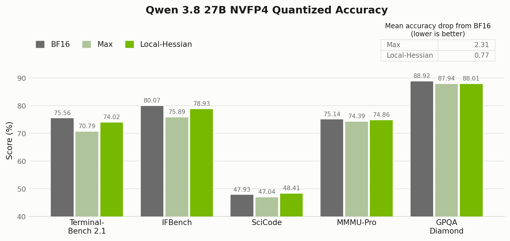
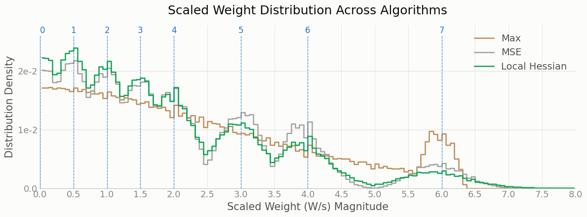

:orphan:

Improving NVFP4 Accuracy with Local-Hessian Weight Scales
#########################################################

:Author: Model Optimizer Team
:Date: September 9, 2026
:Tags: local-hessian, quantization, nvfp4, calibration, modelopt

.. role:: local-hessian-result(strong)
.. role:: table-header-note

In this blog, we share about Model Optimizer 'Local-Hessian', an algorithm for NVFP4 per-block scale selection
to minimize the output error. We used this algorithm to create a low loss checkpoint
`nvidia/Qwen3.8-27B-NVFP4 <https://huggingface.co/nvidia/Qwen3.8-27B-NVFP4>`_ which can leverage NVFP4 tensor cores for performant inference on Blackwell GPUs.
Here is a comparison of accuracy results we observed for 'Local-Hessian' algorithm compared to the default max algorithm:

**Figure 1. Qwen3.8-27B NVFP4 accuracy comparison between the default NVFP4 algorithm (max) and 'Local-Hessian'.**

Scale Selection For NVFP4
**************************

NVFP4 represents each group of 16 weights with FP4 values and an FP8 block
scale [1]_. This block scale is used to scale the per-block values so to NVFP4 E2M1 range (-6.0, 6.0).
The default way is to set the block scale based on the per-block maximum value (max scaling) [1]_.

As originally shown in the 'Four-Over-Six' paper [2]_, this block scale can be selected based on other
criteria such as per-block error. 'Four-Over-Six' selects the per-block scale from 2 candidates, while the
:func:`Model-Optimizer Mean Square Error (MSE) <modelopt.torch.quantization.model_calib.mse_calibrate>` algorithm uses an exhaustive sweep over all positive, non-zero FP8
scales (126 values).

Both of these approaches for scale selection consider only weight tensor-level error, which we find does not correlate
well with downstream accuracy evaluation results.

How Local-Hessian Works
***********************

NVFP4 **Local-Hessian** chooses each per-block weight scale to minimize
the *output* error of the matrix multiplication rather than the weight
error. Nothing about the format changes -- we just compute the per-block
scales differently from max scaling.

Consider a linear layer :math:`Y=WX` with weights
:math:`W\in\mathbb{R}^{C_{\mathrm{out}}\times C_{\mathrm{in}}}` and
calibration inputs
:math:`X\in\mathbb{R}^{C_{\mathrm{in}}\times N}`, where :math:`N` is the
number of calibration tokens. Quantizing divides the weights by a scale
and casts, where the cast rounds each value onto the grid of the
low-precision format:

.. math::
   :label: lh-quant

   \mathcal{Q}(W,s)=\operatorname{Cast}(W/s)\cdot s.

This leaves a quantization error

.. math::
   :label: lh-quant-error

   \Delta(W,s)=\mathcal{Q}(W,s)-W.

What we actually care about is the error this puts on the layer output,
measured over the calibration set:

.. math::
   :label: lh-output-error

   E(s) &= \lVert WX-\mathcal{Q}(W,s)\,X\rVert_F^2
         = \lVert \Delta(W,s)\,X\rVert_F^2 \\
        &= \operatorname{tr}\!\left(\Delta(W,s)\,(XX^{\top})\,
           \Delta(W,s)^{\top}\right).

The input second-moment matrix
:math:`XX^{\top}\in\mathbb{R}^{C_{\mathrm{in}}\times C_{\mathrm{in}}}` is
half the Hessian of the output error,
:math:`\partial^2E(s)/\partial\Delta(W,s)^2=2XX^{\top}`: it weights each
weight error by how much that input coordinate actually moves the
output. The trace operator :math:`\operatorname{tr}(\cdot)` sums one
quadratic-error term per output channel, allowing the channels to be optimized
independently.

For NVFP4, :math:`s` is not a scalar: each output channel has
:math:`C_{\mathrm{in}}/16` blocks, one scale each. With :math:`M`
candidates per block, minimizing :math:`E(s)` jointly means searching
:math:`M^{C_{\mathrm{in}}/16}` combinations -- this is not tractable. To make
the search tractable, Local-Hessian uses a block-diagonal approximation: it adds
the output error from each block independently and ignores interactions between
quantization errors in different blocks. For block :math:`b`,

.. math::
   :label: lh-block-error

   E_b(s_b) = \Delta(W_b,s_b)\,(X_bX_b^{\top})\,\Delta(W_b,s_b)^{\top},

where :math:`W_b\in\mathbb{R}^{1\times16}` is one NVFP4 block of weights,
:math:`s_b` is that block's scale, and
:math:`X_b\in\mathbb{R}^{16\times N}` holds the rows of :math:`X` the
block multiplies, so the local Hessian :math:`X_bX_b^{\top}` is only
:math:`16\times16`. We sweep all 126 candidate FP8 scales per block, just
as the MSE algorithm does; because blocks are independent, a
:func:`Triton kernel <modelopt.torch.kernels.quantization.gemm.nvfp4_fp8_sweep.nvfp4_fp8_scale_sweep_hessian>`
does the whole layer at once. See the
:func:`Model Optimizer Local-Hessian code <modelopt.torch.quantization.model_calib.local_hessian_calibrate>`
for details.

Local-Hessian Results
**********************

Accuracy Comparison
====================

In Table 1 we compare Local-Hessian against other scale-selection algorithms for weights on Qwen3.5-9B.

Local-Hessian gives the overall best accuracy among the NVFP4
weight-scale selection methods, cutting the average drop from 5.10 to 3.10
points against the default max rule. We get that from nothing but a
smarter way of computing the weight scale -- which says something about
micro-block formats like NVFP4: **the scale carries a lot of
information, and it pays to set it diligently.**

.. list-table::
   :header-rows: 1

   * - Weight scale selection method
     - MMLU
     - HellaSwag
     - WinoGrande
     - GSM8K
     - Average drop :table-header-note:`(lower is better)`
     - WikiText PPL :table-header-note:`(lower is better)`
   * - BF16 reference
     - 78.69
     - 78.04
     - 73.40
     - 87.64
     - 0.00
     - 9.20
   * - Max scale
     - 75.81
     - 76.33
     - 70.64
     - 74.60
     - 5.10
     - 10.08
   * - MSE scale
     - 76.49
     - 76.61
     - **72.45**
     - 76.72
     - 3.87
     - 9.98
   * - Four-over-six scale
     - 75.32
     - **76.62**
     - 70.40
     - 76.42
     - 4.75
     - 10.02
   * - Local-Hessian scale
     - **76.81**
     - 76.50
     - 71.19
     - **80.89**
     - :local-hessian-result:`3.10`
     - :local-hessian-result:`9.90`

.. rst-class:: table-note

**Table 1: Scale selection algorithm comparison.** All layers except the final
output layer (``lm_head``) use NVFP4 weight and activation quantization (W4A4).

Local-Hessian With GPTQ
=================================

Local-Hessian changes scales; GPTQ [3]_ changes weight rounding to
minimize per-layer output error. The two are orthogonal, so they
compose: Local-Hessian rounds to nearest (RTN) by default, and GPTQ can
replace that rounding step once the scales are set. In Table 2, we show
that Local-Hessian scales improve GPTQ as well.

Two things stand out:

#. Local-Hessian scale selection alone (3.10 average drop) beats GPTQ with
   max scales (4.84).
#. Combining Local-Hessian scales with GPTQ improves the average drop further,
   from 3.10 to 2.94.

.. list-table::
   :header-rows: 1

   * - Method
     - MMLU
     - HellaSwag
     - WinoGrande
     - GSM8K
     - Average drop
     - WikiText PPL
   * - Max scale + GPTQ
     - 75.77
     - 76.51
     - 70.17
     - 75.97
     - 4.84
     - 10.02
   * - Local-Hessian scale + GPTQ
     - **76.98**
     - **76.59**
     - 70.96
     - 81.50
     - :local-hessian-result:`2.94`
     - :local-hessian-result:`9.91`

.. rst-class:: table-note

**Table 2: GPTQ composition on Qwen3.5-9B, NVFP4 W4A4.**

.. note::

   Composition is not always a win: on Qwen3.8-27B, Local-Hessian + GPTQ scored
   below Local-Hessian alone, so the published checkpoint uses Local-Hessian
   only. This shows the best algorithm could vary depending on the model.

Scale Selection Reshapes Distribution
*************************************

Figure 2 plots the scaled weights :math:`W/s` -- the values handed to the
E2M1 cast. Max scaling piles the mass up near 6.0, the largest E2M1 value,
while MSE and Local-Hessian both cluster it on the representable E2M1 grid
values. Grid alignment alone does not explain the accuracy gains. Although
MSE and Local-Hessian both align weights to the E2M1 grid, Local-Hessian's
layer-output-error objective yields larger downstream accuracy improvements
in our results.

.. rst-class:: table-note

**Figure 2. Scaled weight distribution across algorithms.** Blue
dashed lines are the NVFP4 E2M1 representable values. Distribution is for the
first gate-projection layer of Qwen3.8-27B.

Just Better Scales, No Runtime Cost
***********************************

Local-Hessian and the other ModelOpt scale-selection algorithms for
NVFP4 weight scales are free. Weight scales are computed only once, at
checkpoint creation, and that same scale is reused on every
deployment. Selecting scales this way improves accuracy without
incurring any deployment throughput penalty.

Using Local-Hessian
*******************

See the
:func:`local_hessian_calibrate API <modelopt.torch.quantization.model_calib.local_hessian_calibrate>`
for the calibration entry point.

To use it in your own configuration, set the ``algorithm`` field:

.. code-block:: python

   import modelopt.torch.quantization as mtq

   config = {
       "quant_cfg": [...],  # quantizer configuration
       "algorithm": {
           "method": "local_hessian",
           "layerwise": {"enable": True},
       },
   }

   model = mtq.quantize(model, config, forward_loop)

See :ref:`quant-cfg` for how to write the ``quant_cfg`` field.

To reproduce the published Qwen3.8-27B checkpoint end to end:

.. code-block:: bash

   python examples/hf_ptq/hf_ptq.py \
       --pyt_ckpt_path Qwen/Qwen3.8-27B \
       --recipe modelopt_recipes/models/Qwen/Qwen3.8-27B/ptq/nvfp4_w4a4_mlp_fp8_attn_local_hessian.yaml \
       --dataset nemotron-post-training-v3 \
       --calib_size 512 \
       --calib_seq 2048 \
       --batch_size 1 \
       --export_path <export_dir>

.. note::

   For Local-Hessian and GPTQ, we recommend enabling
   :func:`layerwise_calibrate <modelopt.torch.quantization.model_calib.layerwise_calibrate>`
   with ``"layerwise": {"enable": True}`` and using calibration batch size 1.
   Layerwise calibration exposes each layer to the fake-quantized outputs of the
   preceding layer, approximating quantized deployment, while batch size 1 prevents
   padding tokens from contaminating activation statistics.

Next steps
**********

- **Adapt Local-Hessian for sparse MoEs.** Many experts in a sparse MoE
  see very little calibration data. Local-Hessian workflow needs to be adapted to that
  low-data regime.

.. _local-hessian-references:

References
**********

.. [1] E. Alvarez, O. Almog, E. Chung, S. Layton, D. Stosic, R. Krashinsky,
   and K. Aubrey. `Introducing NVFP4 for Efficient and Accurate Low-Precision
   Inference <https://developer.nvidia.com/blog/introducing-nvfp4-for-efficient-and-accurate-low-precision-inference/>`_.
   NVIDIA Technical Blog, 2025.
.. [2] J. Cook, J. Guo, G. Xiao, Y. Lin, K. Wyss, M. Nazemi, A. Mishra,
   C. del Mundo, T. Blankevoort, and S. Han. `Four Over Six: More Accurate
   NVFP4 Quantization with Adaptive Block Scaling
   <https://arxiv.org/abs/2512.02010>`_. arXiv:2512.02010, 2025.
.. [3] E. Frantar, S. Ashkboos, T. Hoefler, and D. Alistarh. `GPTQ: Accurate
   Post-Training Quantization for Generative Pre-trained Transformers
   <https://arxiv.org/abs/2210.17323>`_. ICLR, 2023.
