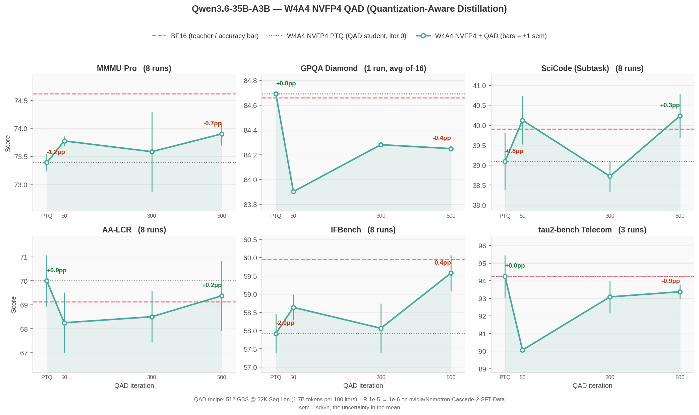

:orphan:

Recovering W4A4 NVFP4 Accuracy with Quantization-Aware Distillation
###################################################################

:Author: Model Optimizer Team
:Date: September 16, 2026
:Tags: quantization, nvfp4, w4a4, qad, distillation, megatron-bridge

Weight-only NVFP4 does not make this model faster. On Blackwell, a BF16 activation forces vLLM onto
the Marlin dequant-to-BF16 fallback, which never reaches the FP4 tensor cores: W4A16 measured
*slower* than BF16 in 10 of 12 shapes. Quantizing activations as well (W4A4) unlocks those kernels
and beats BF16 in 9 of 12 shapes, but costs accuracy that post-training quantization alone does not
recover. Quantization-Aware Distillation (QAD) is what closes that gap.

We ran the full flow on `Qwen/Qwen3.6-35B-A3B <https://huggingface.co/Qwen/Qwen3.6-35B-A3B>`_ with
Megatron-Bridge: W4A4 NVFP4 PTQ, then 500 QAD iterations against the BF16 teacher, evaluated across
six benchmarks. The complete reproduction steps, configs and recipe are in the
`tutorial <https://github.com/NVIDIA/Model-Optimizer/tree/main/examples/megatron_bridge/tutorials/Qwen3.6-35B-A3B>`__.

Highlights
**********

* **W4A4 is the configuration worth targeting.** It beats BF16 in 9 of 12 measured shapes (up to
  1.30x) and shrinks the checkpoint from 67 GiB to 22 GiB (3.1x). Weight-only W4A16 is slower than
  BF16 in 10 of 12.
* **Only 2 of 6 benchmarks lost measurable accuracy to W4A4**, so those are the only two where QAD
  has anything to recover.
* **IFBench is fully recovered.** PTQ costs 2.6 pp; 500 QAD iterations return the model to
  statistical parity with BF16.
* **MMMU-Pro recovers about 40%** of its deficit and retains a measurable gap — the blend is
  text-only, and MMMU-Pro is multimodal.
* **Repeat counts matter more than expected.** At 3 repeats one benchmark showed a 3 pp swing that
  vanished at 8, and IFBench's real gain was invisible until 8.

Results
*******

**Figure 1. W4A4 NVFP4 accuracy vs. QAD training iteration, Qwen3.6-35B-A3B.** Each panel starts at
the PTQ student (x=0) and follows it through 500 QAD iterations. The dashed line is the BF16
teacher; the dotted line is the PTQ starting point. Bars are ±1 sem.

Accuracy, ``mean ± sem`` across repeats:

.. list-table::
   :header-rows: 1
   :widths: 26 12 12 12 12 12 14

   * - Model
     - MMMU-Pro
     - GPQA-D
     - SciCode
     - AA-LCR
     - IFBench
     - tau2-bench
   * - BF16 (teacher)
     - 74.6 ± 0.2
     - 84.7
     - 39.9 ± 0.6
     - 69.1 ± 0.8
     - 60.0 ± 0.5
     - 94.2 ± 1.0
   * - W4A4 NVFP4 PTQ
     - 73.4 ± 0.2
     - 84.7
     - 39.1 ± 0.7
     - 70.0 ± 1.1
     - 57.9 ± 0.5
     - 94.2 ± 1.2
   * - **+ QAD 500 iters**
     - **73.9 ± 0.2**
     - **84.2**
     - **40.2 ± 0.6**
     - **69.4 ± 1.5**
     - **59.6 ± 0.5**
     - **93.4 ± 0.4**

Where QAD Helps
***************

Only IFBench and MMMU-Pro show a W4A4 deficit larger than run-to-run noise. On the other four,
W4A4 is effectively lossless and QAD neither helps nor hurts.

.. list-table::
   :header-rows: 1
   :widths: 22 26 26 26

   * - Benchmark
     - W4A4 PTQ vs BF16
     - After 500 QAD iters
     - Outcome
   * - IFBench
     - −2.6 pp
     - −0.3 pp
     - Recovered to BF16 parity
   * - MMMU-Pro
     - −1.2 pp
     - −0.7 pp
     - ~40% recovered, gap remains

Throughput
**********

Measured with AIPerf against a served vLLM endpoint on 4x GB200, three ISL/OSL shapes at four
concurrencies each (output tokens/s):

.. list-table::
   :header-rows: 1
   :widths: 26 14 14 16 16 14

   * - Shape (ISL/OSL)
     - Conc.
     - BF16
     - W4A16 NVFP4
     - W4A4 NVFP4
     - W4A4 / BF16
   * - decode 128/2048
     - 128
     - 17,636
     - 15,222
     - **20,076**
     - **1.14x**
   * - chat 8000/1000
     - 32
     - 3,649
     - 2,373
     - **4,079**
     - **1.12x**
   * - prefill 32000/400
     - 128
     - 854
     - 1,092
     - **1,107**
     - **1.30x**

W4A4 loses to BF16 only at concurrency 1, by a near-constant 0.87–0.88x across all three shapes.
That is fixed per-call overhead in the FP4 kernel path, which batch-1 decode has no arithmetic
intensity to amortize — not a recipe knob.

What It Costs
*************

QAD dominates: 500 iterations at 32K sequence length on 32 nodes (128 GB200) took 5.7 hours,
about 735 GPU-hours. PTQ is 9 minutes and the HF export a few more. Evaluating one checkpoint
across all six benchmarks at the repeat counts above is roughly 100 GPU-hours.

Learn More
**********

The `tutorial <https://github.com/NVIDIA/Model-Optimizer/tree/main/examples/megatron_bridge/tutorials/Qwen3.6-35B-A3B>`__
has the full reproduction path — data blend, PTQ recipe, QAD command, export, and one NeMo Evaluator
config per benchmark — plus the parallelism constraints QAD imposes on this model and what we would
try next to close the remaining MMMU-Pro gap.
