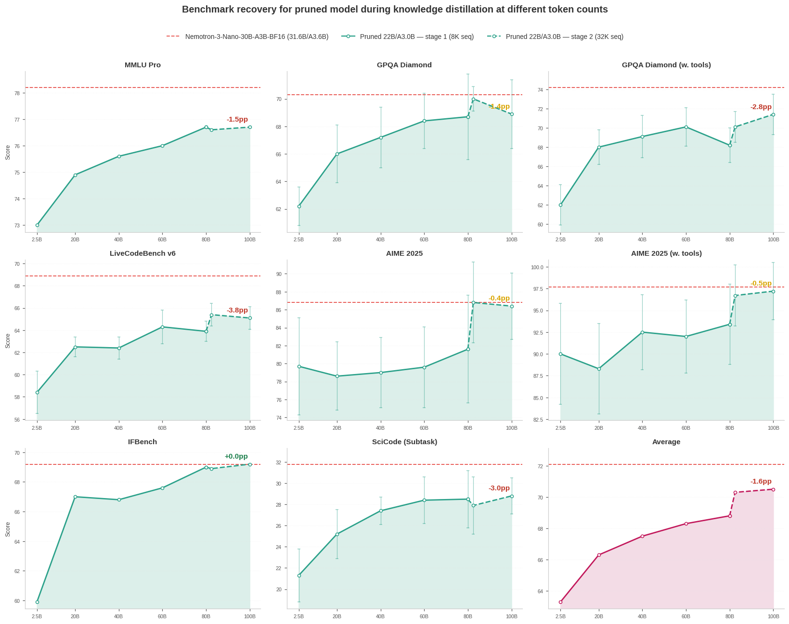

# Nemotron-3-Nano-30B-A3B: Prune + Distill + Quantize + vLLM Deployment

End-to-end optimization of [NVIDIA-Nemotron-3-Nano-30B-A3B-BF16](https://huggingface.co/nvidia/NVIDIA-Nemotron-3-Nano-30B-A3B-BF16) demonstrating how ModelOpt techniques stack: Minitron structured pruning → Megatron-Bridge knowledge distillation to recover accuracy → evaluation benchmarking → FP8 quantization → vLLM deployment and throughput benchmarking. This document covers:

1. **[Data Preparation](#1-data-preparation)** — tokenizing the training blend for distillation
2. **[Pruning](#2-pruning)** — Minitron structured pruning
3. **[Distillation](#3-distillation)** — recovering accuracy via Megatron-Bridge knowledge distillation
4. **[Evaluation](#4-evaluation)** — benchmarking with NeMo Evaluator across MMLU Pro, GPQA Diamond, AIME, and more
5. **[Quantization](#5-quantization)** — FP8 PTQ on the distilled checkpoint using ModelOpt's `examples/megatron_bridge/quantize.py` script
6. **[vLLM Inference Benchmarking](#6-vllm-inference-benchmarking)** — throughput comparison across BF16 and FP8 on a single H100

## Results



<b>Main results</b> — all models evaluated with the same [setup](#4-evaluation). Values are `mean ± std_dev` across repeats:

| Model | MMLU Pro | GPQA Diamond | GPQA Diamond (w. tools) | LiveCodeBench v6 | AIME 2025 | AIME 2025 (w. tools) | IFBench | SciCode (Subtask) | Average |
| --- | --- | --- | --- | --- | --- | --- | --- | --- | --- |
| **Pruned 22B/A3.0B + Distilled — 100B tokens (BF16)** | 76.7 | 68.9 ± 2.5 | 71.4 ± 2.1 | 65.1 ± 1.0 | 86.4 ± 3.7 | 97.2 ± 3.3 | 69.2 | 28.8 ± 1.7 | 70.5 |
| &nbsp;&nbsp;↳ **FP8** (quantized from BF16) | 75.9 | 71.1 ± 1.4 | 70.4 ± 1.1 | 64.8 ± 0.9 | 87.0 ± 4.2 | 95.1 ± 4.8 | 68.2 | 28.7 ± 2.5 | 70.2 |
| **Official Nemotron-3-Nano-30B-A3B-BF16 (31.6B/A3.6B)** | 78.2 | 70.3 ± 1.7 | 74.2 ± 1.9 | 68.9 ± 0.9 | 86.8 ± 4.4 | 97.7 ± 3.3 | 69.2 | 31.8 ± 1.2 | 72.1 |

<details>
<summary><b>Full results</b> — pruning baseline and full distillation trajectory (click to expand)</summary>

| Model | MMLU Pro | GPQA Diamond | GPQA Diamond (w. tools) | LiveCodeBench v6 | AIME 2025 | AIME 2025 (w. tools) | IFBench | SciCode (Subtask) | Average |
| --- | --- | --- | --- | --- | --- | --- | --- | --- | --- |
| Pruned 22B/A3.0B (no distillation) | 47.8 | 33.5 ± 2.3 | 34.2 ± 3.0 | 26.7 ± 1.3 | 15.1 ± 3.8 | 17.8 ± 5.5 | 39.9 | 13.1 ± 1.8 | 28.5 |
| Distill @ 2.5B tokens (100 iters at 8K SeqLen) | 73.0 | 62.2 ± 1.4 | 62.0 ± 2.1 | 58.4 ± 1.9 | 79.7 ± 5.4 | 90.0 ± 5.8 | 59.9 | 21.3 ± 2.5 | 63.3 |
| Distill @ 20B tokens (800 iters at 8K SeqLen) | 74.9 | 66.0 ± 2.1 | 68.0 ± 1.8 | 62.5 ± 0.9 | 78.6 ± 3.8 | 88.3 ± 5.2 | 67.0 | 25.2 ± 2.3 | 66.3 |
| Distill @ 40B tokens (1600 iters at 8K SeqLen) | 75.6 | 67.2 ± 2.2 | 69.1 ± 2.2 | 62.4 ± 1.0 | 79.0 ± 3.9 | 92.5 ± 4.3 | 66.8 | 27.4 ± 1.3 | 67.5 |
| Distill @ 60B tokens (2400 iters at 8K SeqLen) | 76.0 | 68.4 ± 2.0 | 70.1 ± 2.0 | 64.3 ± 1.5 | 79.6 ± 4.5 | 92.0 ± 4.2 | 67.6 | 28.4 ± 2.2 | 68.3 |
| Distill @ 80B tokens (3200 iters at 8K SeqLen) | 76.7 | 68.7 ± 3.1 | 68.2 ± 1.8 | 63.9 ± 0.9 | 81.6 ± 6.0 | 93.4 ± 4.6 | 69.0 | 28.5 ± 2.7 | 68.8 |
| Distill @ 82.5B tokens (+100 iters at 32K SeqLen) | 76.6 | 70.0 ± 0.9 | 70.1 ± 1.6 | 65.4 ± 1.0 | 86.8 ± 4.5 | 96.7 ± 3.5 | 68.9 | 27.9 ± 2.7 | 70.3 |
| Distill @ 100B tokens (+800 iters at 32K SeqLen) - **BF16** | 76.7 | 68.9 ± 2.5 | 71.4 ± 2.1 | 65.1 ± 1.0 | 86.4 ± 3.7 | 97.2 ± 3.3 | 69.2 | 28.8 ± 1.7 | 70.5 |
| Distill @ 100B tokens + **FP8 Quantize** | 75.9 | 71.1 ± 1.4 | 70.4 ± 1.1 | 64.8 ± 0.9 | 87.0 ± 4.2 | 95.1 ± 4.8 | 68.2 | 28.7 ± 2.5 | 70.2 |
| Nemotron-3-Nano-30B-A3B-BF16 (official, 31.6B/A3.6B) | 78.2 | 70.3 ± 1.7 | 74.2 ± 1.9 | 68.9 ± 0.9 | 86.8 ± 4.4 | 97.7 ± 3.3 | 69.2 | 31.8 ± 1.2 | 72.1 |

</details>

> [!NOTE]
> Some of these benchmarks are very noisy with a large per-run spread (e.g. AIME, which has only 30 problems, and SciCode), so small differences are not always meaningful. For a more reliable comparison, use a larger `num_repeats` in practice.

### vLLM Throughput (single H100, ISL=32768, OSL=1024)

| Checkpoint | Model loading memory | Output tokens/s | Speedup vs Nemotron-3-Nano-30B-A3B-BF16 |
| --- | --- | --- | --- |
| Nemotron-3-Nano-30B-A3B-BF16 (official, 31.6B/A3.6B) | 58.9 GiB | 598 | 1.0× |
| Nemotron-3-Nano-30B-A3B-FP8 (official) | 31.4 GiB | 1,323 | 2.2× |
| Nemotron-3-Nano-Pruned-22B-A3.0B-BF16 | 41.5 GiB | 1,190 | 2.0× |
| Nemotron-3-Nano-Pruned-22B-A3.0B-FP8 | 22.8 GiB | 1,576 | 2.6× |

Pruning alone (BF16 → Pruned-A3.0B BF16) gives a **2.0×** throughput speedup with a 30% memory reduction (58.9 → 41.5 GiB), and FP8 quantization alone (BF16 → FP8) gives a **2.2×** speedup with a 47% memory reduction. Stacking both — pruning + FP8 — compounds to a **2.6×** throughput speedup and a **2.6× memory reduction** (58.9 → 22.8 GiB) relative to the original 30B BF16 model, while preserving most of the benchmark accuracy. See [Section 6](#6-vllm-inference-benchmarking) for the benchmark command.

Distillation uses the **30% Pretraining (Code 5, General 20, MATH 5) + 70% Post-training v1/v3 (Math 27, Coding 20, Science 13, IF 5, Tool calling 5)** blend (see [Data Blend](#data-blend) below) with an **80B @ 8K + 20B @ 32K = 100B token** schedule. Blend ablations and long-context phase ablations are in [ABLATIONS.md](ABLATIONS.md).

> [!TIP]
> From the benchmark numbers above, the model is still learning at 100B tokens and that further training (or a higher-quality data blend) would continue to close the gap to the original 31.6B/A3.6B model.

> [!NOTE]
> Exact numbers may vary depending on deployment and evaluation setup. All models above (including the official model) were evaluated with the same [evaluation setup](#4-evaluation) for fair comparison. These numbers may differ from those reported on the official [Nemotron-3-Nano-30B-A3B-BF16](https://huggingface.co/nvidia/NVIDIA-Nemotron-3-Nano-30B-A3B-BF16) HuggingFace model card.

---

## Steps to Reproduce

**Environment:** Container `nvcr.io/nvidia/nemo:26.04`, ModelOpt 0.45.0. See the [Megatron-Bridge README](../../README.md) for environment setup (including ModelOpt mount path) and container usage. Pruning Nemotron models requires `transformers<5` via `python -m pip install "transformers<5"` else saving pruned model as HF checkpoint may fail.

### 1. Data Preparation

See [examples/dataset/MEGATRON_DATA_PREP.md](../../../dataset/MEGATRON_DATA_PREP.md) for tokenization commands for all datasets used in this blend.

For this experiment: `TOKENIZER=nvidia/NVIDIA-Nemotron-3-Nano-30B-A3B-BF16`, `OUTPUT_DIR=tokenized_nemotron_3`.

#### Data Blend

**30% Pretraining (Code 5, General 20, MATH 5) + 70% Post-training v1/v3 (Math 27, Coding 20, Science 13, IF 5, Tool calling 5)**

| Dataset                                                    | Tokens | Weight | Notes                                          |
| ---------------------------------------------------------- | ------ | ------ | ---------------------------------------------- |
| Nemotron-Pretraining-SFT-v1 / Code (10M samples)           | 7B     | 5      | Pretraining code                               |
| Nemotron-Pretraining-SFT-v1 / General (10M samples)        | 16B    | 20     | Upweighted to close MMLU gap                   |
| Nemotron-Pretraining-SFT-v1 / MATH (10M samples)           | 13B    | 5      | Pretraining math                               |
| Nemotron-Math-v2 / high_part00                             | 13B    | 10     | Hard math reasoning                            |
| Nemotron-SFT-Math-v3 / train                               | 52B    | 17     | Hard math reasoning with full reasoning traces |
| Nemotron-SFT-Competitive-Programming-v2 / python_00        | 7B     | 15     | Python reasoning traces                        |
| Nemotron-SFT-Competitive-Programming-v2 / cpp_00           | 7B     | 5      | C++ reasoning traces                           |
| Nemotron-Post-Training-Dataset-v1 / stem (5M samples)      | 22B    | 8      | Broad STEM                                     |
| Nemotron-Science-v1 / MCQ                                  | 0.5B   | 3      | GPQA MCQ format alignment                      |
| Nemotron-Science-v1 / RQA                                  | 0.3B   | 2      | GPQA format diversity                          |
| Nemotron-SFT-Instruction-Following-Chat-v2 / reasoning_on  | 2B     | 3      | Instruction following (thinking on)            |
| Nemotron-SFT-Instruction-Following-Chat-v2 / reasoning_off | 1B     | 2      | Instruction following (thinking off)           |
| Nemotron-Agentic-v1 / tool_calling                         | 1B     | 5      | Tool-use scaffolding; helps SciCode / GPQA     |

<details>
<summary>Data blend for distillation (click to expand)</summary>

```bash
DATA_BLEND=" \
5  tokenized_nemotron_3/nvidia--Nemotron-Pretraining-SFT-v1_Nemotron-SFT-Code_train_text_max10000000 \
20 tokenized_nemotron_3/nvidia--Nemotron-Pretraining-SFT-v1_Nemotron-SFT-General_train_text_max10000000 \
5  tokenized_nemotron_3/nvidia--Nemotron-Pretraining-SFT-v1_Nemotron-SFT-MATH_train_text_max10000000 \
10 tokenized_nemotron_3/nvidia--Nemotron-Math-v2_default_high_part00_messages \
17 tokenized_nemotron_3/nvidia--Nemotron-SFT-Math-v3_default_train_messages \
15 tokenized_nemotron_3/competitive_programming_python_00_messages \
5  tokenized_nemotron_3/competitive_programming_cpp_00_messages \
8  tokenized_nemotron_3/nvidia--Nemotron-Post-Training-Dataset-v1_default_stem_messages_max5000000 \
3  tokenized_nemotron_3/MCQ_messages \
2  tokenized_nemotron_3/RQA_messages \
3  tokenized_nemotron_3/reasoning_on_messages \
2  tokenized_nemotron_3/reasoning_off_messages \
5  tokenized_nemotron_3/nvidia--Nemotron-Agentic-v1_tool_calling_messages \
"
```

</details>

#### General Guidelines

The optimal blend is 30% pretraining and 70% post-training data. Exact proportions may vary depending on the benchmarks you care about. The blend above was designed to maximize recovery on popular General Knowledge, Reasoning, Coding, and Instruction Following benchmarks. The key design decisions were:

- **30% pretraining data** closes the MMLU gap that arises from training exclusively on reasoning-heavy post-training data. The General split (20%) is upweighted specifically to recover general knowledge recall.
- **Math (27%)** is the largest post-training category because AIME and MMLU Pro respond strongly to more math reasoning tokens. We use a mix of `Nemotron-Math-v2` and `Nemotron-SFT-Math-v3` for higher quality math reasoning signal with full reasoning traces.
- **Science (13%)** uses `Nemotron-Post-Training-Dataset-v1 / stem` as the primary source for volume and GPQA stability, with small allocations to `Nemotron-Science-v1` MCQ/RQA subsets for format alignment with GPQA's multiple-choice structure.
- **Instruction following (5%)** saturates quickly so a small allocation is sufficient.
- **Tool calling (5%)** uses `Nemotron-Agentic-v1 / tool_calling`. Our GPQA and AIME evals enable a Python sandbox tool (`--enable-auto-tool-choice`), so the student needs explicit exposure to function-call schemas to use it; this helps GPQA Diamond and AIME 2025 (which can offload quantitative steps to the tool).

This blend intentionally omits capabilities not targeted in this experiment (e.g. multilingual, SWE). Depending on what benchmarks matter for your use case, you can substitute or add datasets from the [Nemotron Post-Training v3 collection](https://huggingface.co/collections/nvidia/nemotron-post-training-v3), for example:

| Capability | Relevant datasets |
| --- | --- |
| Multilingual | `Nemotron-SFT-Multilingual-v1` |
| Software engineering (SWE) | `Nemotron-SFT-SWE-v2` |
| Safety / alignment | `Nemotron-SFT-Safety-v1` |

When adding new datasets, reduce weights of lower-priority categories proportionally to keep the total at 100%.

---

### 2. Pruning

Here we prune the [NVIDIA-Nemotron-3-Nano-30B-A3B-BF16](https://huggingface.co/nvidia/NVIDIA-Nemotron-3-Nano-30B-A3B-BF16) HuggingFace checkpoint from 31.6B/A3.6B to 3.0B active parameters. The output is a pruned HuggingFace checkpoint that feeds into the distillation step.

Run on **1 node with 8x H100** (~30 mins)

<details>
<summary>Pruning command (click to expand)</summary>

```bash
torchrun --nproc_per_node 8 /opt/Model-Optimizer/examples/megatron_bridge/prune_minitron.py \
  --hf_model_name_or_path nvidia/NVIDIA-Nemotron-3-Nano-30B-A3B-BF16 \
  --trust_remote_code \
  --pp_size 8 \
  --num_layers_in_first_pipeline_stage 5 \
  --num_layers_in_last_pipeline_stage 5 \
  --calib_batch_size 8 \
  --seq_length 8192 \
  --prune_target_active_params 3e9 \
  --prune_target_params 24e9 \
  --prune_score_func mmlu_10pct_bs32 \
  --max_width_pruning 0.30 \
  --max_depth_pruning 0.15 \
  --hparams_to_skip num_attention_heads \
  --top_k 10 \
  --output_hf_path /path/to/Nemotron-3-Nano-30B-A3B-Pruned-A3.0B
```

Non-default arguments:

- `--num_layers_in_first_pipeline_stage 5 --num_layers_in_last_pipeline_stage 5` — Uneven pipeline parallelism since 52 layers is not divisible by 8 GPUs
- `--calib_batch_size 8` (default: 1) — faster calibration with larger batch size using more memory.
- `--seq_length 8192` (default: 4096) — more tokens for better MoE calibration
- `--prune_target_active_params 3e9` — MoE-specific; the **primary** pruning constraint — targets active params rather than total params, which is what matters for MoE inference cost
- `--prune_target_params 24e9` — upper bound on total params only; the actual pruned model total can range anywhere from ~19B to 24B depending on which architecture wins — see pruning logs below for the top 10 candidates. You may also skip this argument all together for simplicity.
- `--prune_score_func mmlu_10pct_bs32` (default: `mmlu_10pct_bs1`) — batch_size=32 for ~3–4× faster candidate scoring
- `--max_width_pruning 0.30` (default: 0.40) — tighter constraint to prevent head_dim≤48 and hidden=2048 dead zones
- `--max_depth_pruning 0.15` (default: 0.20) — tighter constraint since candidates with 42–46 layers universally fail for this model
- `--hparams_to_skip num_attention_heads` (default: none) — attention heads pruning is harder to recover, hence skipped

**NOTE**: The tighter search space constraints here (`--max_depth_pruning`, `--max_width_pruning`) are specific to Nemotron hybrid models (Mamba + Attention + MoE). Unlike standard transformers which expose only layers/hidden/attention/FFN dimensions, these models add Mamba-specific dimensions (`mamba_num_heads`, `mamba_head_dim`) and MoE dimensions (`num_moe_experts`, `moe_ffn_hidden_size`, `moe_shared_expert_intermediate_size`), making the combined search space much larger. The default 40%/20% bounds cast too wide a net and waste compute on dead-zone architectures.

See [ABLATIONS.md](ABLATIONS.md#pruning) for the full architecture search analysis across various candidates.
</details>

<details>
<summary>Pruning logs (top 10 candidates, best subnet, layer patterns) (click to expand)</summary>

```text
╭───────────────────────────────────────────────────── Original Model Stats ──────────────────────────────────────────────────────╮
│ Total Parameters                              31.58B                                                                            │
│ Active Parameters                             3.58B                                                                             │
│ Memory (BF16, seq_length=8192, batch_size=8)  weights: 60230.1 MB, kv_cache: 384.0 MB, mamba_state: 190.5 MB, Total: 60804.6 MB │
╰─────────────────────────────────────────────────────────────────────────────────────────────────────────────────────────────────╯

                              Search Space
                   (≤30% width / ≤15% depth pruning)
┏━━━━━━━━━━━━━━━━━━━━━━━━━━━━━━━━━━━━━┳━━━━━━━━━━━━━━━━━━━━━━━━━━━━━━━━┓
┃ Hyperparameter                      ┃ Choices                        ┃
┡━━━━━━━━━━━━━━━━━━━━━━━━━━━━━━━━━━━━━╇━━━━━━━━━━━━━━━━━━━━━━━━━━━━━━━━┩
│ num_layers                          │ [46, 48, 50, 52]               │
│ hidden_size                         │ [2048, 2304, 2560, 2688]       │
│ mamba_num_heads                     │ [48, 56, 64]                   │
│ mamba_head_dim                      │ [48, 56, 64]                   │
│ num_moe_experts                     │ [96, 104, 112, 120, 128]       │
│ moe_ffn_hidden_size                 │ [1536, 1792, 1856]             │
│ moe_shared_expert_intermediate_size │ [2816, 3072, 3328, 3584, 3712] │
├─────────────────────────────────────┼────────────────────────────────┤
│ Search space size                   │ 10800                          │
└─────────────────────────────────────┴────────────────────────────────┘

                                                                 Top 10 Candidates with Scores
┏━━━━┳━━━━━━━━━━━━━━━━━━━━━━━━━━━━━━━━━━━━━━━━━━━━━━━━━━━━━━━━━━━━━━━━━━━━━━━━━━━━━━━━━━━━━━━━━━━━━━━━━━━━━━━━━━━━━━━━━━━━━━━┳━━━━━━━━━━━━━━━┳━━━━━━━━┳━━━━━━━━┓
┃  # ┃ export_config                                                                                                         ┃ active_params ┃ params ┃  score ┃
┡━━━━╇━━━━━━━━━━━━━━━━━━━━━━━━━━━━━━━━━━━━━━━━━━━━━━━━━━━━━━━━━━━━━━━━━━━━━━━━━━━━━━━━━━━━━━━━━━━━━━━━━━━━━━━━━━━━━━━━━━━━━━━╇━━━━━━━━━━━━━━━╇━━━━━━━━╇━━━━━━━━┩
│  1 │ {'num_layers': 52, 'hidden_size': 2688, 'mamba_num_heads': 56, 'mamba_head_dim': 48, 'num_moe_experts': 96,           │         3.00B │ 20.09B │ 0.2811 │
│    │ 'moe_ffn_hidden_size': 1536, 'moe_shared_expert_intermediate_size': 3072}                                             │               │        │        │
│  2 │ {'num_layers': 52, 'hidden_size': 2688, 'mamba_num_heads': 48, 'mamba_head_dim': 56, 'num_moe_experts': 104,          │         3.00B │ 21.61B │ 0.2622 │
│    │ 'moe_ffn_hidden_size': 1536, 'moe_shared_expert_intermediate_size': 3072}                                             │               │        │        │
│  3 │ {'num_layers': 52, 'hidden_size': 2560, 'mamba_num_heads': 48, 'mamba_head_dim': 64, 'num_moe_experts': 96,           │         3.00B │ 19.28B │ 0.4098 │
│    │ 'moe_ffn_hidden_size': 1536, 'moe_shared_expert_intermediate_size': 3712}                                             │               │        │        │
│  4 │ {'num_layers': 52, 'hidden_size': 2304, 'mamba_num_heads': 64, 'mamba_head_dim': 64, 'num_moe_experts': 104,          │         3.00B │ 22.28B │ 0.4993 │
│    │ 'moe_ffn_hidden_size': 1856, 'moe_shared_expert_intermediate_size': 3072}                                             │               │        │        │
│  5 │ {'num_layers': 52, 'hidden_size': 2560, 'mamba_num_heads': 48, 'mamba_head_dim': 48, 'num_moe_experts': 96,           │         3.00B │ 21.99B │ 0.2559 │
│    │ 'moe_ffn_hidden_size': 1792, 'moe_shared_expert_intermediate_size': 3328}                                             │               │        │        │
│  6 │ {'num_layers': 48, 'hidden_size': 2560, 'mamba_num_heads': 56, 'mamba_head_dim': 56, 'num_moe_experts': 104,          │         3.00B │ 23.68B │ 0.4566 │
│    │ 'moe_ffn_hidden_size': 1792, 'moe_shared_expert_intermediate_size': 3072}                                             │               │        │        │
│  7 │ {'num_layers': 46, 'hidden_size': 2560, 'mamba_num_heads': 64, 'mamba_head_dim': 56, 'num_moe_experts': 104,          │         3.00B │ 23.68B │ 0.2371 │
│    │ 'moe_ffn_hidden_size': 1792, 'moe_shared_expert_intermediate_size': 3072}                                             │               │        │        │
│  8 │ {'num_layers': 52, 'hidden_size': 2688, 'mamba_num_heads': 48, 'mamba_head_dim': 56, 'num_moe_experts': 96,           │         3.00B │ 20.09B │ 0.2601 │
│    │ 'moe_ffn_hidden_size': 1536, 'moe_shared_expert_intermediate_size': 3072}                                             │               │        │        │
│  9 │ {'num_layers': 52, 'hidden_size': 2304, 'mamba_num_heads': 64, 'mamba_head_dim': 64, 'num_moe_experts': 96,           │         3.00B │ 20.70B │ 0.4734 │
│    │ 'moe_ffn_hidden_size': 1856, 'moe_shared_expert_intermediate_size': 3072}                                             │               │        │        │
│ 10 │ {'num_layers': 50, 'hidden_size': 2560, 'mamba_num_heads': 48, 'mamba_head_dim': 48, 'num_moe_experts': 104,          │         3.00B │ 23.68B │ 0.2699 │
│    │ 'moe_ffn_hidden_size': 1792, 'moe_shared_expert_intermediate_size': 3712}                                             │               │        │        │
└────┴───────────────────────────────────────────────────────────────────────────────────────────────────────────────────────┴───────────────┴────────┴────────┘

╭──────────────────────────────────────────────────────────────────────── Best Subnet ─────────────────────────────────────────────────────────────────────────╮
│ export_config  {'num_layers': 52, 'hidden_size': 2304, 'mamba_num_heads': 64, 'mamba_head_dim': 64, 'num_moe_experts': 104, 'moe_ffn_hidden_size': 1856,     │
│                'moe_shared_expert_intermediate_size': 3072}                                                                                                  │
│ active_params  3.00B                                                                                                                                         │
│ params         22.28B                                                                                                                                        │
│ score          0.4993                                                                                                                                        │
╰──────────────────────────────────────────────────────────────────────────────────────────────────────────────────────────────────────────────────────────────╯

Original hybrid_layer_pattern: MEMEM*EMEMEM*EMEMEM*EMEMEM*EMEMEM*EMEMEMEM*EMEMEMEME
Pruned hybrid_layer_pattern:   MEMEM*EMEMEM*EMEMEM*EMEMEM*EMEMEM*EMEMEMEM*EMEMEMEME

╭────────────────────────────────────────────────────── Pruned Model Stats ───────────────────────────────────────────────────────╮
│ Total Parameters                              22.28B                                                                            │
│ Active Parameters                             3.00B                                                                             │
│ Memory (BF16, seq_length=8192, batch_size=8)  weights: 42489.7 MB, kv_cache: 384.0 MB, mamba_state: 190.5 MB, Total: 43064.2 MB │
╰─────────────────────────────────────────────────────────────────────────────────────────────────────────────────────────────────╯
```

</details>

> [!TIP]
> Candidate selection above relies on the pruning score alone — it does not run a short KD trial per candidate to pick the winner. The main post-pruning distillation in [Section 3](#3-distillation) is still performed on the selected candidate. If you want a stronger pick, take a few top candidates' `export_config` from the logs above (where the score is similar to the best subnet), export them separately, run KD for ~2B tokens on each, and pick the best on your target metrics. See [ABLATIONS.md — 1st vs 2nd best candidate](ABLATIONS.md#distillation-results-1st-best-vs-2nd-best-pruning-candidate) for a concrete comparison.

---

### 3. Distillation

Distillation is run in two phases: an 80B-token phase at 8K sequence length, followed by a 20B-token long-context phase at 32K sequence length. The two phases are launched as separate runs with an intermediate Megatron→HF checkpoint conversion, because the long-context phase changes `seq_length`, `gbs`, and `cp_size` — Megatron's checkpoint resume bookkeeping (sample counter is in absolute samples, iteration counter is in iter-units tied to `gbs`) does not handle a mid-run `gbs` change cleanly.

Minimum hardware: **4 nodes × 8x H100 (32 GPUs)** for the 8K phase — required by `TP=4 × EP=8`. The 32K phase additionally requires context parallel to fit the longer sequence, doubling the minimum to **8 nodes × 8x H100 (64 GPUs)**. On **96 nodes × 8x H100 (768 GPUs total)**, it takes ~900 H100 GPU-hours per 10B tokens (400 iters), i.e. ~70 min wall-clock per 10B tokens on 96 nodes. Full schedule (80B @ 8K + 20B @ 32K = 100B tokens, 4k total steps) takes ~9k H100 GPU-hours (~12 hours wall-clock).

#### 3a. Phase 1 — 80B tokens @ 8K seq length

<details>
<summary>Phase 1 distillation command (click to expand)</summary>

> NOTE: We use `python -u` for slurm multi-node run here.

```bash
python -u /opt/Model-Optimizer/examples/megatron_bridge/distill.py \
    --teacher_hf_path nvidia/NVIDIA-Nemotron-3-Nano-30B-A3B-BF16 \
    --student_hf_path /path/to/Nemotron-3-Nano-30B-A3B-Pruned-A3.0B \
    --trust_remote_code \
    --tp_size 4 \
    --ep_size 8 \
    --data_paths "${DATA_BLEND}" \
    --data_path_to_cache /path/to/cache \
    --seq_length 8192 \
    --mbs 1 \
    --gbs 3072 \
    --train_iters 3200 \
    --lr 1e-4 \
    --min_lr 1e-5 \
    --lr_warmup_iters 25 \
    --eval_interval 200 \
    --eval_iters 8 \
    --log_interval 10 \
    --output_dir /path/to/distill_output_phase1_8k

# Optional: Weights & Biases logging
#     --wandb_project <wandb_project> \
#     --wandb_entity <wandb_entity> \
#     --wandb_exp_name <wandb_exp_name>
```

Non-default arguments:

- `--seq_length 8192` (default: 4096)
- `--gbs 3072` (default: 768) — matches the original Nemotron-3-Nano-30B training GBS from the paper, kept to preserve the training distribution
- `--train_iters 3200` — 80B tokens at GBS 3072 × seq_length 8192
- `--lr 1e-4 --min_lr 1e-5 --lr_warmup_iters 25` — cosine fully decays over 3200 iters; the model is approaching saturation at 8K by this point (see [ABLATIONS.md — 8K trajectory](ABLATIONS.md#effect-of-data-blend-tool_calling)).
- `--eval_interval 200` (default: 100) — less frequent eval to save compute
- `--eval_iters 8` (default: 32) — since GBS is 4× larger than default

All other arguments use defaults.
</details>

#### 3b. Convert Phase 1 final checkpoint to HuggingFace format

Phase 2 starts as a separate run from a fresh HuggingFace student checkpoint, so the final Phase 1 Megatron checkpoint must be exported to HF first using the Megatron-Bridge conversion script (see [Megatron-Bridge README](../../README.md) for full details). You can also use this same script to convert any intermediate Phase 1 checkpoint to HF format for evaluation along the way.

<details>
<summary>Checkpoint conversion command (click to expand)</summary>

> NOTE: Below command only works for non-quantized checkpoints. For quantized checkpoints, we use the `export.py` script in Section 5 to directly export the quantized checkpoint to Unified HF format for deployment.

```bash
python /opt/Megatron-Bridge/examples/conversion/convert_checkpoints.py export \
    --hf-model /path/to/Nemotron-3-Nano-30B-A3B-Pruned-A3.0B \
    --megatron-path /path/to/distill_output_phase1_8k/checkpoints/iter_0003200 \
    --hf-path /path/to/distill_output_phase1_8k/checkpoints/hf_iter_0003200 \
    --trust-remote-code
```

</details>

#### 3c. Phase 2 — 20B tokens @ 32K seq length

Phase 2 is a **fresh run** with the Phase 1 final checkpoint as the new student. It uses a different `--seed` so the data blend reshuffles (otherwise the model would see overlapping prefix of the same samples it already saw at 8K). The LR is bumped back up modestly to capture the rapid long-context adaptation observed in [ABLATIONS.md — Effect of long context training](ABLATIONS.md#effect-of-long-context-training).

<details>
<summary>Phase 2 distillation command (click to expand)</summary>

```bash
python -u /opt/Model-Optimizer/examples/megatron_bridge/distill.py \
    --teacher_hf_path nvidia/NVIDIA-Nemotron-3-Nano-30B-A3B-BF16 \
    --student_hf_path /path/to/distill_output_phase1_8k/checkpoints/hf_iter_0003200 \
    --trust_remote_code \
    --tp_size 4 \
    --cp_size 2 \
    --ep_size 8 \
    --seed 5678 \
    --data_paths "${DATA_BLEND}" \
    --data_path_to_cache /path/to/cache \
    --seq_length 32768 \
    --mbs 1 \
    --gbs 768 \
    --train_iters 800 \
    --lr 2e-5 \
    --min_lr 1e-5 \
    --lr_warmup_iters 10 \
    --recompute_granularity selective \
    --recompute_modules moe \
    --eval_interval 200 \
    --eval_iters 8 \
    --log_interval 10 \
    --output_dir /path/to/distill_output_phase2_32k
```

Changed arguments from Phase 1:

- `--student_hf_path` — points at the HF export of the Phase 1 final checkpoint
- `--seq_length 32768` — long-context phase
- `--gbs 768` — `seq_length × gbs` product unchanged, so each iter still processes the same number of tokens
- `--cp_size 2` — context parallel is needed to fit the longer sequence; doubles the minimum-hardware footprint to 8 nodes
- `--train_iters 800` — 20B tokens at GBS 768 × seq_length 32768
- `--lr 2e-5 --min_lr 1e-5 --lr_warmup_iters 10` — modest LR bump for the long-context adaptation (Phase 1 ended at fully-decayed LR 1e-5); the 10-iter warmup re-populates Adam moment estimates which restart from zero in a fresh run
- `--recompute_granularity selective --recompute_modules moe` — selective MoE recompute further reduces activation memory at 32K. You may skip this if you have more memory.
- `--seed 5678` — different from the Phase 1 seed (default 1234) so the data blend reshuffles
- `--output_dir /path/to/distill_output_phase2_32k` — must be a **fresh directory** different from Phase 1's, so distill.py's resume mechanism (which auto-loads from `<output_dir>/checkpoints` if it exists) does not pull in stale state

</details>

For multi-node Slurm runs, see the [Megatron-Bridge README](../../README.md#slurm-usage) for details.

> [!NOTE]
> This is pure SFT-style distillation — no RL or online reward signal is used. Adding an RL-based post-training step after distillation is a natural next step that could further improve some of these benchmarks.

#### 3d. Convert Phase 2 final checkpoint to HuggingFace format

We use the same conversion script to convert the Phase 2 final checkpoint to HuggingFace format.

<details>
<summary>Checkpoint conversion command (click to expand)</summary>

> NOTE: Below command only works for non-quantized checkpoints. For quantized checkpoints, we use the `export.py` script in Section 5 to directly export the quantized checkpoint to Unified HF format for deployment.

```bash
python /opt/Megatron-Bridge/examples/conversion/convert_checkpoints.py export \
    --hf-model /path/to/Nemotron-3-Nano-30B-A3B-Pruned-A3.0B \
    --megatron-path /path/to/distill_output_phase2_32k/checkpoints/iter_0000800 \
    --hf-path /path/to/distill_output_phase2_32k/checkpoints/hf_iter_0000800 \
    --trust-remote-code
```

</details>

---

### 4. Evaluation

The eval config in [nemo_evaluator.yaml](nemo_evaluator.yaml) is for Slurm-based evaluation — it submits a vLLM serving job (with tool calling enabled via `--enable-auto-tool-choice --tool-call-parser qwen3_coder`) and runs evals against it. For local model execution and evaluation, refer to the [NeMo Evaluator documentation](https://docs.nvidia.com/nemo/evaluator/latest/) or this [blog](https://huggingface.co/blog/nvidia/nemotron-3-nano-evaluation-recipe).

**Tasks and exact metric names reported in the results table:**

| Benchmark | Library | num_repeats | Metric name |
| --- | --- | --- | --- |
| MMLU Pro | NeMo Evaluator | 1 | `mmlu-pro_pass_at_1_symbolic_correct` |
| GPQA Diamond | NeMo Evaluator | 8 | `gpqa_pass_at_1_avg-of-8_symbolic_correct` |
| LiveCodeBench v6 | NeMo Evaluator | 4 | `livecodebench_pass_at_1_avg-of-4_accuracy` |
| AIME 2025 | NeMo Evaluator | 32 | `aime25_pass_at_1_avg-of-32_symbolic_correct` |
| IFBench | NeMo Evaluator | 8 | `ifbench_pass_at_1_avg-of-8_average_score` |
| SciCode (Subtask) | NeMo Evaluator | 8 | `scicode_pass_at_1_avg-of-8_subtask_accuracy` |

<details>
<summary>Evaluation launch steps (click to expand)</summary>

Before running, update the following fields in the `nemo_evaluator.yaml` file or overwrite them in the command line with `-o <option>=<value>`:

- `execution.hostname` — your Slurm login node hostname
- `execution.account` — your Slurm account
- `deployment.checkpoint_path` — Hugging Face checkpoint path (original, pruned, or quantized)

The yaml is set up for a **BF16** checkpoint. For **FP8** or **NVFP4** checkpoints, also apply the quantization-specific vLLM deployment settings documented at the top of `nemo_evaluator.yaml`:
- append `--kv-cache-dtype fp8` to `deployment.extra_args`
- set the matching FlashInfer MoE env vars in `deployment.env_vars` (`VLLM_USE_FLASHINFER_MOE_FP8` for FP8 / `VLLM_USE_FLASHINFER_MOE_FP4` for NVFP4, plus `VLLM_FLASHINFER_MOE_BACKEND: throughput`)

```bash
pip install "nemo-evaluator-launcher[all]==0.1.82"

# Set required environment variables:
export HF_TOKEN=<your_huggingface_token>
export SLURM_JOB_DIR=<path_to_slurm_job_output_dir>
export HF_HOME=<path_to_huggingface_cache>
export VLLM_CACHE_ROOT=<path_to_vllm_cache>

# Set additional unused but required environment variables:
export API_KEY=xxxxxx
export INFERENCE_API_KEY=xxxxxx
export OPENAI_CLIENT_ID=xxxxxx
export OPENAI_CLIENT_SECRET=xxxxxx

# Run the evaluation
# To run a small subset and verify the end-to-end eval pipeline before launching full evals, add `-o ++evaluation.nemo_evaluator_config.config.params.limit_samples=8` (applies to all tasks)
# To restrict which tasks run, add `-t <task_name>` to the command.
nemo-evaluator-launcher run --config nemo_evaluator.yaml
```

</details>

For more details on NeMo Evaluator, see the [GitHub repo](https://github.com/NVIDIA-NeMo/evaluator) and [documentation](https://docs.nvidia.com/nemo/evaluator/latest/).

---

### 5. Quantization

ModelOpt allows stacking multiple optimization techniques. Here we stack FP8 quantization on top of the pruned and distilled model to get an even more optimized model. See [examples/megatron_bridge/README.md](../../README.md) for the full Megatron-Bridge PTQ documentation.

Similar to the official [Nemotron-3-Nano-30B-A3B-FP8](https://huggingface.co/nvidia/NVIDIA-Nemotron-3-Nano-30B-A3B-FP8) model, if you want to quantize the pruned 22B/A3.0B model to FP8, the Mamba, MoE, and MLP layers are quantized to FP8, while the attention layers and the Conv1d components within the Mamba layers are kept in BF16 to avoid accuracy degradation.

This is done with the `MAMBA_MOE_FP8_CONSERVATIVE_CFG` config defined in [`modelopt/torch/quantization/config.py`](../../../../modelopt/torch/quantization/config.py), which you select by passing `--quant_cfg MAMBA_MOE_FP8_CONSERVATIVE_CFG` below. For a faster model at the cost of a larger accuracy drop, you can use `MAMBA_MOE_FP8_AGGRESSIVE_CFG` instead.

> [!NOTE]
> You can also quantize to NVFP4 using `--quant_cfg MAMBA_MOE_NVFP4_CONSERVATIVE_CFG` or `MAMBA_MOE_NVFP4_AGGRESSIVE_CFG` (faster, more accuracy drop). NVFP4 typically needs further [Quantization Aware Distillation (QAD)](../../README.md#quantization-aware-distillation-qad) to recover accuracy, plus a Blackwell GPU for deployment.

Quantization is a two-step flow: `quantize.py` calibrates and saves a Megatron checkpoint, then `export.py` converts it to a deployable HuggingFace checkpoint (the unified HF exporter loads at TP=1, so pipeline parallelism is used to shard across GPUs). Both steps take a few minutes on 8x H100.

**Step 1 — calibrate and save the quantized Megatron checkpoint:**

<details>
<summary>FP8 PTQ command (click to expand)</summary>

```bash
torchrun --nproc_per_node 8 /opt/Model-Optimizer/examples/megatron_bridge/quantize.py \
    --hf_model_name_or_path /path/to/distill_output_phase2_32k/checkpoints/hf_iter_0000800 \
    --trust_remote_code \
    --tp_size 8 \
    --quant_cfg MAMBA_MOE_FP8_CONSERVATIVE_CFG \
    --calib_batch_size 4 \
    --seq_length 8192 \
    --export_megatron_path /path/to/distill_output_phase2_32k/checkpoints/iter_0000800_fp8_megatron \
    --skip_generate
```

</details>

**Step 2 — export the Megatron checkpoint to a deployable HuggingFace checkpoint:**

<details>
<summary>Export command (click to expand)</summary>

```bash
torchrun --nproc_per_node 1 /opt/Model-Optimizer/examples/megatron_bridge/export.py \
    --hf_model_name_or_path /path/to/distill_output_phase2_32k/checkpoints/hf_iter_0000800 \
    --megatron_path /path/to/distill_output_phase2_32k/checkpoints/iter_0000800_fp8_megatron \
    --trust_remote_code \
    --pp_size 1 \
    --export_unified_hf_path /path/to/distill_output_phase2_32k/checkpoints/hf_iter_0000800_fp8
```

</details>

The exported HuggingFace checkpoint is directly deployable with [vLLM](https://github.com/vllm-project/vllm), [TensorRT-LLM](https://github.com/NVIDIA/TensorRT-LLM) and [SGLang](https://github.com/sgl-project/sglang).

> [!TIP]
> Run text generation on sample prompts to sanity-check the quantized checkpoint generates reasonable output:
>
> ```bash
> python /opt/Model-Optimizer/examples/megatron_bridge/generate_vllm.py \
>     --model /path/to/distill_output_phase2_32k/checkpoints/hf_iter_0000800_fp8 \
>     --trust_remote_code
> ```

> [!TIP]
> You can run the evaluation using the same `nemo_evaluator.yaml` file for the quantized checkpoint also — just apply the FP8/NVFP4 deployment tweaks documented at the top of the yaml. To evaluate an NVFP4 checkpoint, you need a Blackwell GPU.

See FP8 vs BF16 results in the [Results](#results) section above.

---

### 6. vLLM Inference Benchmarking

Benchmark throughput using [vLLM](https://github.com/vllm-project/vllm) on a single H100 GPU.

<details>
<summary>vLLM benchmark commands (ISL=32768, OSL=1024) (click to expand)</summary>

```bash
# BF16 (original or pruned)
vllm bench throughput \
    --model <bf16_checkpoint_path> \
    --random-input-len 32768 \
    --random-output-len 1024 \
    --trust-remote-code \
    --mamba_ssm_cache_dtype float32 \
    --load-format safetensors

# FP8 (Hopper GPU)
VLLM_USE_FLASHINFER_MOE_FP8=1 VLLM_FLASHINFER_MOE_BACKEND=throughput \
vllm bench throughput \
    --model <fp8_checkpoint_path> \
    --random-input-len 32768 \
    --random-output-len 1024 \
    --trust-remote-code \
    --mamba_ssm_cache_dtype float32 \
    --kv-cache-dtype fp8 \
    --load-format safetensors
```

</details>

See the [vLLM Throughput table in Results](#vllm-throughput-single-h100-isl32768-osl1024) for measured numbers.

> [!TIP]
> To deploy the model with vLLM, you can refer to the [vLLM Quickstart documentation](https://docs.vllm.ai/en/stable/getting_started/quickstart/).
