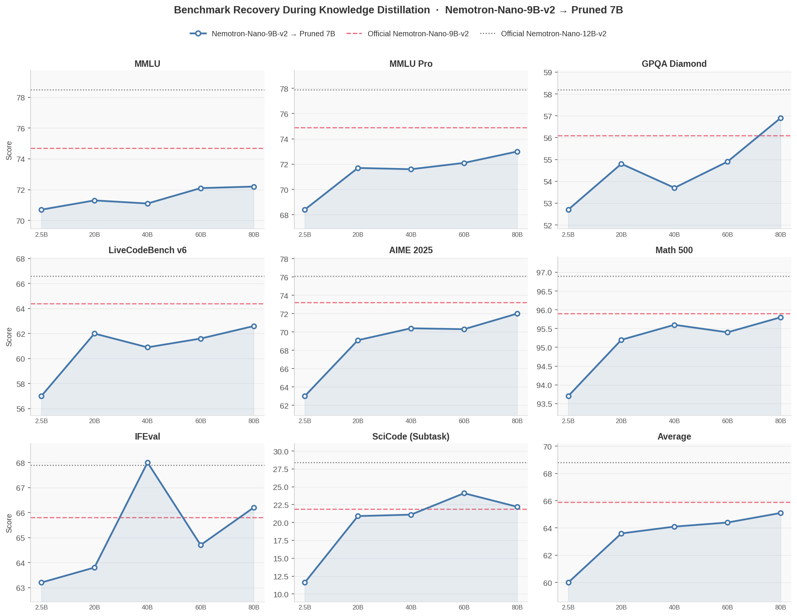

# Nemotron-Nano-9B-v2: Prune + Distill + Quantize + vLLM Deployment

End-to-end optimization of [Nemotron-Nano-9B-v2](https://huggingface.co/nvidia/NVIDIA-Nemotron-Nano-9B-v2) demonstrating how ModelOpt techniques stack: Minitron structured pruning to 7B → Megatron-Bridge knowledge distillation to recover accuracy → FP8 quantization → vLLM deployment and throughput benchmarking. This document covers:

1. **[Data Preparation](#1-data-preparation)** — tokenizing the training blend for distillation
2. **[Pruning](#2-pruning)** — Minitron structured pruning from 9B to 7B
3. **[Distillation](#3-distillation)** — recovering accuracy via Megatron-Bridge knowledge distillation (up to 80B tokens)
4. **[Evaluation](#4-evaluation)** — benchmarking with NeMo Evaluator across MMLU Pro, GPQA Diamond, AIME, and more
5. **[Quantization](#5-quantization)** — FP8 PTQ on the distilled checkpoint using ModelOpt's `examples/llm_ptq/hf_ptq.py` script
6. **[vLLM Inference Benchmarking](#6-vllm-inference-benchmarking)** — throughput comparison of BF16 vs FP8 on a single H100

**Environment:** Container `nvcr.io/nvidia/nemo:26.02`, ModelOpt 0.44.0. See the [Megatron-Bridge README](../../../megatron_bridge/README.md) for environment setup (including ModelOpt mount path) and container usage.

## Results



| Model | MMLU | MMLU Pro | GPQA Diamond | LiveCodeBench v6 | AIME 2025 | Math 500 | IFEval | SciCode (Subtask) | Average |
| --- | --- | --- | --- | --- | --- | --- | --- | --- | --- |
| Pruned 7B (no distillation) | 67.8 | 11.9 | 17.7 | 1.4 | 0.3 | 6.0 | 41.8 | 0.1 | 18.4 |
| Pruned 7B + distill 2.5B tokens (400 iters) | 70.7 | 68.4 | 52.7 | 57.0 | 63.0 | 93.7 | 63.2 | 11.6 | 60.0 |
| Pruned 7B + distill 20B tokens (3200 iters) | 71.3 | 71.7 | 54.8 | 62.0 | 69.1 | 95.2 | 63.8 | 20.9 | 63.6 |
| Pruned 7B + distill 40B tokens (6400 iters) | 71.1 | 71.6 | 53.7 | 60.9 | 70.4 | 95.6 | 68.0 | 21.1 | 64.1 |
| Pruned 7B + distill 60B tokens (9600 iters) | 72.1 | 72.1 | 54.9 | 61.6 | 70.3 | 95.4 | 64.7 | 24.1 | 64.4 |
| Pruned 7B + distill 80B tokens (12800 iters) | 72.2 | 73.0 | 56.9 | 62.6 | 72.0 | 95.8 | 66.2 | 22.2 | 65.1 |
| Nemotron-Nano-9B-v2 (official, pruned from 12B) | 74.7 | 74.9 | 56.1 | 64.4 | 73.2 | 95.9 | 65.8 | 21.9 | 65.9 |
| Nemotron-Nano-12B-v2 (official) | 78.5 | 77.9 | 58.2 | 66.6 | 76.1 | 96.9 | 67.9 | 28.4 | 68.8 |

**Key observations:**

- **All benchmarks recover dramatically within the first checkpoint (2.5B tokens).** The pruned-only model is essentially non-functional, but a single distillation run recovers most capabilities.
- **Math 500 and IFEval plateau quickly** — essentially saturated after 2.5B tokens, with minimal gains over the remaining training.
- **MMLU also largely plateaus** after the first checkpoint.
- **AIME, MMLU Pro, GPQA, and SciCode continue improving** throughout the full run and benefit meaningfully from longer training.
- **The 7B model at 80B tokens closes most of the gap to the official 9B**, and actually exceeds it on GPQA, IFEval, and SciCode. The table below compares the 7B→9B gap against the 9B→12B gap — both are ~25% compression — showing that the second pruning round recovers more efficiently:

| Benchmark | 7B (80B tokens) vs 9B | 9B (official) vs 12B |
| --- | --- | --- |
| MMLU | −2.5 | −3.8 |
| MMLU Pro | −1.9 | −3.0 |
| GPQA Diamond | **+0.8** | −2.1 |
| LiveCodeBench v6 | −1.8 | −2.2 |
| AIME 2025 | −1.2 | −2.9 |
| Math 500 | −0.1 | −1.0 |
| IFEval | **+0.4** | −2.1 |
| SciCode (Subtask) | **+0.3** | −6.5 |
| Average | −0.8 | −2.9 |

Distillation uses the **30% Pretraining (Code 5, General 20, MATH 5) + 70% Post-training v1/v3 (Math 30, Coding 20, Science 15, IF 5)** blend (see [Data Blend](#data-blend) below). Blend ablations are in [ABLATIONS.md](ABLATIONS.md).

> [!NOTE]
> Exact numbers may vary depending on deployment and evaluation setup. All models above — including the official 9B and 12B — were evaluated with the same [nemo_evaluator.yaml](nemo_evaluator.yaml) for fair comparison. These numbers may differ from those reported on the official [Nemotron-Nano-9B-v2](https://huggingface.co/nvidia/NVIDIA-Nemotron-Nano-9B-v2) and [Nemotron-Nano-12B-v2](https://huggingface.co/nvidia/NVIDIA-Nemotron-Nano-12B-v2) HuggingFace model cards.

> [!NOTE]
> The official Nemotron-Nano-9B-v2 model was itself produced by pruning Nemotron-Nano-12B-v2 using Minitron. See [arxiv:2508.14444](https://arxiv.org/abs/2508.14444) for details on the exact steps used there.

---

## Steps to Reproduce

### 1. Data Preparation

See [examples/dataset/MEGATRON_DATA_PREP.md](../../../dataset/MEGATRON_DATA_PREP.md) for tokenization commands for all datasets used in this blend.

For this experiment: `TOKENIZER=nvidia/NVIDIA-Nemotron-Nano-9B-v2`, `OUTPUT_DIR=tokenized_nemotron_v2`.

#### Data Blend

**30% Pretraining (Code 5, General 20, MATH 5) + 70% Post-training v1/v3 (Math 30, Coding 20, Science 15, IF 5)**

```bash
DATA_BLEND=" \
5  tokenized_nemotron_v2/nvidia--Nemotron-Pretraining-SFT-v1_Nemotron-SFT-Code_train_text_max10000000 \
20 tokenized_nemotron_v2/nvidia--Nemotron-Pretraining-SFT-v1_Nemotron-SFT-General_train_text_max10000000 \
5  tokenized_nemotron_v2/nvidia--Nemotron-Pretraining-SFT-v1_Nemotron-SFT-MATH_train_text_max10000000 \
15 tokenized_nemotron_v2/nvidia--Nemotron-Math-v2_default_high_part00_messages \
15 tokenized_nemotron_v2/nvidia--Nemotron-Math-v2_default_high_part01_messages \
15 tokenized_nemotron_v2/competitive_programming_python_00_messages \
5  tokenized_nemotron_v2/competitive_programming_cpp_00_messages \
10 tokenized_nemotron_v2/nvidia--Nemotron-Post-Training-Dataset-v1_default_stem_messages_max5000000 \
3  tokenized_nemotron_v2/MCQ_messages \
2  tokenized_nemotron_v2/RQA_messages \
3  tokenized_nemotron_v2/reasoning_on_messages \
2  tokenized_nemotron_v2/reasoning_off_messages \
"
```

| Dataset | Tokens | Weight | Notes |
| --- | --- | --- | --- |
| Nemotron-Pretraining-SFT-v1 / Code (10M samples) | 7B | 5 | Pretraining code |
| Nemotron-Pretraining-SFT-v1 / General (10M samples) | 16B | 20 | Upweighted to better close MMLU gap |
| Nemotron-Pretraining-SFT-v1 / MATH (10M samples) | 12B | 5 | Pretraining math |
| Nemotron-Math-v2 / high_part00 | 9B | 15 | Hard math reasoning |
| Nemotron-Math-v2 / high_part01 | 11B | 15 | Hard math reasoning |
| Nemotron-SFT-Competitive-Programming-v2 / python_00 | 7B | 15 | Python reasoning traces |
| Nemotron-SFT-Competitive-Programming-v2 / cpp_00 | 7B | 5 | C++ reasoning traces |
| Nemotron-Post-Training-Dataset-v1 / stem (5M samples) | 20B | 10 | Broad STEM |
| Nemotron-Science-v1 / MCQ | 0.5B | 3 | GPQA MCQ format alignment |
| Nemotron-Science-v1 / RQA | 0.3B | 2 | GPQA format diversity |
| Nemotron-SFT-IF-Chat-v2 / reasoning_on | 2B | 3 | Instruction following (thinking on) |
| Nemotron-SFT-IF-Chat-v2 / reasoning_off | 1B | 2 | Instruction following (thinking off) |

#### General Guidelines

The optimal blend is 30% pretraining and 70% post-training data. Exact proportions may vary depending on the benchmarks you care about. The blend above was designed to maximize recovery on important benchmarks reported in the Nemotron-Nano-9B-v2 model card. The key design decisions were:

- **30% pretraining data** closes the MMLU gap that arises from training exclusively on reasoning-heavy post-training data. The General split (20%) is upweighted specifically to recover general knowledge recall.
- **Math (30%)** is the largest post-training category because AIME and MMLU Pro respond strongly to more math reasoning tokens. Two `Nemotron-Math-v2` splits are used to avoid repetition at longer token budgets.
- **Science (15%)** uses `Nemotron-Post-Training-Dataset-v1 / stem` as the primary source for volume and GPQA stability, with small allocations to `Nemotron-Science-v1` MCQ/RQA subsets for format alignment with GPQA's multiple-choice structure.
- **Instruction following (5%)** saturates quickly — IFEval reaches 60+% within 2.5B tokens — so a small allocation is sufficient.

This blend intentionally omits capabilities not targeted in this experiment (e.g. long context and multilingual benchmarks). Depending on what benchmarks matter for your use case, you can substitute or add datasets from the [Nemotron Post-Training v3 collection](https://huggingface.co/collections/nvidia/nemotron-post-training-v3), for example:

| Capability | Relevant datasets |
| --- | --- |
| Multilingual | `Nemotron-SFT-Multilingual-v1` |
| Agentic / tool use | `Nemotron-SFT-Tool-Call-v1`, `Nemotron-SFT-Tool-Call-v2` |
| Software engineering (SWE) | `Nemotron-SFT-SWE-v1` |
| Safety / alignment | `Nemotron-SFT-Safety-v1` |
| Long context | `Nemotron-SFT-Long-Context-v1` |

When adding new datasets, reduce weights of lower-priority categories proportionally to keep the total at 100%.

---

### 2. Pruning

Run on **1 node with 8x H100** (~1 hour)

Non-default arguments: `--hparams_to_skip num_attention_heads` (default: none; attention heads pruning is harder to recover hence skipped), `--seq_length 8192` (default: 4096) since dataset has longer sequences. All other arguments use defaults i.e. we optimize for MMLU (10% subset, 0-shot) for the pruned model (without distillation).

```bash
torchrun --nproc_per_node 8 /opt/Model-Optimizer/examples/megatron_bridge/prune_minitron.py \
  --pp_size 8 \
  --hf_model_name_or_path nvidia/NVIDIA-Nemotron-Nano-9B-v2 \
  --trust_remote_code \
  --prune_target_params 7e9 \
  --hparams_to_skip num_attention_heads \
  --seq_length 8192 \
  --output_hf_path /path/to/Nemotron-Nano-9B-v2-Pruned-7B
```

Important pruning logs:

```text
Only considering atmost 40% for width and 20% for depth pruning hparams
Skipping hparams_to_skip=['num_attention_heads'] during search space generation...
        Search space for num_layers: [46, 48, 50, 52, 54, 56]
        Search space for hidden_size: [2816, 3072, 3328, 3584, 3840, 4096, 4352, 4480]
        Search space for mamba_num_heads: [80, 88, 96, 104, 112, 120, 128]
        Search space for mamba_head_dim: [56, 64, 72, 80]
        Search space for ffn_hidden_size: [9728, 10240, 10752, 11264, 11776, 12288, 12800, 13312, 13824, 14336, 14848, 15360, 15680]
        Total search space in consideration: 17472

Top 10 candidates with scores:
{'num_layers': 50, 'hidden_size': 4480, 'mamba_num_heads': 128, 'mamba_head_dim': 56, 'ffn_hidden_size': 15680} -> 7.00B params, 0.2019 score
{'num_layers': 56, 'hidden_size': 4096, 'mamba_num_heads': 96, 'mamba_head_dim': 80, 'ffn_hidden_size': 14336} -> 7.00B params, 0.4363 score
{'num_layers': 48, 'hidden_size': 4352, 'mamba_num_heads': 120, 'mamba_head_dim': 80, 'ffn_hidden_size': 13824} -> 7.00B params, 0.6789 score [BEST SUBNET]
{'num_layers': 56, 'hidden_size': 4352, 'mamba_num_heads': 112, 'mamba_head_dim': 80, 'ffn_hidden_size': 10240} -> 7.00B params, 0.5203 score
{'num_layers': 54, 'hidden_size': 4480, 'mamba_num_heads': 104, 'mamba_head_dim': 80, 'ffn_hidden_size': 11264} -> 7.00B params, 0.2615 score
{'num_layers': 46, 'hidden_size': 4480, 'mamba_num_heads': 128, 'mamba_head_dim': 72, 'ffn_hidden_size': 14848} -> 7.00B params, 0.6165 score
{'num_layers': 50, 'hidden_size': 4480, 'mamba_num_heads': 112, 'mamba_head_dim': 64, 'ffn_hidden_size': 15680} -> 7.00B params, 0.4214 score
{'num_layers': 54, 'hidden_size': 4096, 'mamba_num_heads': 112, 'mamba_head_dim': 80, 'ffn_hidden_size': 13312} -> 7.00B params, 0.5894 score
{'num_layers': 56, 'hidden_size': 4352, 'mamba_num_heads': 120, 'mamba_head_dim': 72, 'ffn_hidden_size': 10752} -> 7.00B params, 0.4688 score
{'num_layers': 52, 'hidden_size': 4352, 'mamba_num_heads': 120, 'mamba_head_dim': 72, 'ffn_hidden_size': 12800} -> 7.00B params, 0.5596 score

Dropping decoder layers [43, 44, 45, 46, 47, 48, 50, 52] from model.
Original hybrid_override_pattern: M-M-M-MM-M-M-M*-M-M-M*-M-M-M-M*-M-M-M-M*-M-MM-M-M-M-M-M-
Pruned hybrid_override_pattern: M-M-M-MM-M-M-M*-M-M-M*-M-M-M-M*-M-M-M-M*-MMMM-M-
```

> [!TIP]
> Here we skip the Knowledge Distillation (KD) step for candidates for simplicity. If you want to find a better pruned model, you can take the top K candidates' `export_config` from the logs above and then export all models separately and perform KD for ~2B tokens on each of them before selecting the best subnet based on your desired metrics.

---

### 3. Distillation

Non-default arguments: `--seq_length 8192` (default: 4096), `--mbs 4` (default: 1), `--train_iters 16000` (train upto ~100B tokens — can stop earlier and take intermediate checkpoints for smaller runs), `--lr_warmup_iters 100` (default: 50), `--eval_interval 400` (default: 100). All other arguments use defaults.

Run on **96 nodes × 8x H100 (768 GPUs total)**. ~600 H100 GPU-hours per 1k steps (~6.3B tokens), i.e. ~45 min wall-clock per 1k steps. Full 80B token run (~13k steps) takes ~9k H100 GPU-hours (~10 hours wall-clock).

>[!TIP]
> While we use 96 nodes here for faster training, you can also run with 1 node. If you dont want to do full distillation run, you can stop earlier and take intermediate checkpoints as well.

```bash
torchrun --nproc_per_node 8 /opt/Model-Optimizer/examples/megatron_bridge/distill_minitron.py \
    --teacher_hf_path nvidia/NVIDIA-Nemotron-Nano-9B-v2 \
    --student_hf_path /path/to/Nemotron-Nano-9B-v2-Pruned-7B \
    --trust_remote_code \
    --tp_size 8 \
    --pp_size 1 \
    --data_paths "${DATA_BLEND}" \
    --data_path_to_cache /path/to/cache \
    --seq_length 8192 \
    --mbs 4 \
    --gbs 768 \
    --train_iters 16000 \
    --lr 1e-4 \
    --min_lr 1e-5 \
    --lr_warmup_iters 100 \
    --eval_interval 400 \
    --eval_iters 32 \
    --log_interval 10 \
    --output_dir <output_dir>

# Optional: Weights & Biases logging
#     --wandb_project <wandb_project> \
#     --wandb_entity <wandb_entity> \
#     --wandb_exp_name <wandb_exp_name>
```

For multi-node Slurm runs, see the [Megatron-Bridge README](../../../megatron_bridge/README.md#slurm-usage) for details.

Distillation saves checkpoints in Megatron distributed format under `<output_dir>/checkpoints/iter_XXXXXXX`. You can convert any intermediate checkpoint to HuggingFace format using the Megatron-Bridge conversion script (see [Megatron Bridge README](../../../megatron_bridge/README.md) for full details):

```bash
python /opt/Megatron-Bridge/examples/conversion/convert_checkpoints.py export \
    --hf-model /path/to/Nemotron-Nano-9B-v2-Pruned-7B \
    --megatron-path <output_dir>/checkpoints/iter_<iter_number> \
    --hf-path <output_dir>/checkpoints/hf_iter_<iter_number>
```

---

### 4. Evaluation

The eval config xin [nemo_evaluator.yaml](nemo_evaluator.yaml) is for Slurm-based evaluation — it submits a vLLM serving job and runs evals against it. For local model execution and evaluation, refer to the [NeMo Evaluator documentation](https://docs.nvidia.com/nemo/evaluator/latest/) or this [blog](https://huggingface.co/blog/nvidia/nemotron-3-nano-evaluation-recipe).

Before running, update the following fields in the yaml:

- `execution.hostname` — your Slurm login node hostname
- `execution.account` — your Slurm account
- `deployment.checkpoint_path` — Hugging Face checkpoint path (original, pruned or quantized)
- `evaluation.nemo_evaluator_config.config.params.extra.tokenizer` — same path as `checkpoint_path`

> [!TIP]
> Uncomment `limit_samples` under any task to run a small subset and verify the end-to-end eval pipeline before launching full evals.

```bash
pip install "nemo-evaluator-launcher[all]==0.1.90"

# Set required environment variables:
export HF_TOKEN=<your_huggingface_token>
export SLURM_JOB_DIR=<path_to_slurm_job_output_dir>
export HF_HOME=<path_to_huggingface_cache>
export VLLM_CACHE_ROOT=<path_to_vllm_cache>

# Set additional unused but required environment variables:
export API_KEY=xxxxxx
export INFERENCE_API_KEY=xxxxxx
export OPENAI_CLIENT_ID=xxxxxx
export OPENAI_CLIENT_SECRET=xxxxxx

nemo-evaluator-launcher run --config nemo_evaluator.yaml
```

**Tasks and exact metric names reported in the results table:**

| Benchmark | Tool | Metric name |
| --- | --- | --- |
| MMLU | [lm-evaluation-harness](https://github.com/EleutherAI/lm-evaluation-harness) (5-shot) | `mmlu` |
| MMLU Pro | NeMo Evaluator | `mmlu-pro_pass_at_1_symbolic_correct` |
| GPQA Diamond | NeMo Evaluator | `gpqa_pass_at_1_symbolic_correct` |
| LiveCodeBench v6 | NeMo Evaluator | `livecodebench_pass_at_1_accuracy` |
| AIME 2025 | NeMo Evaluator | `aime25_pass_at_1_symbolic_correct` |
| Math 500 | NeMo Evaluator | `AA_math_test_500_score_micro_avg_of_5` |
| IFEval | NeMo Evaluator | `ifeval_pass_at_1_average_score` |
| SciCode (Subtask) | NeMo Evaluator | `scicode_pass_at_1_subtask_accuracy` |

**Key vLLM settings:** Tool calling is not enabled in these evals.

For more details on NeMo Evaluator, see the [GitHub repo](https://github.com/NVIDIA-NeMo/evaluator) and [documentation](https://docs.nvidia.com/nemo/evaluator/latest/).

### 5. Quantization

ModelOpt allows stacking multiple optimization techniques. Here we stack FP8 quantization on top of the pruned and distilled model to get an even more optimized model. See [examples/llm_ptq/README.md](../../../llm_ptq/README.md) for the full PTQ documentation.

Similar to the official [Nemotron-Nano-9B-v2-FP8](https://huggingface.co/nvidia/NVIDIA-Nemotron-Nano-9B-v2-FP8) model, if you want to quantize the pruned 7B model to FP8, the Mamba and MLP layers are quantized to FP8, while all 4 attention layers and the Conv1d components within the Mamba layers are kept in BF16 to avoid accuracy degradation.

This is done with the `mtq.MAMBA_MOE_FP8_AGGRESSIVE_CFG` config defined in [`modelopt/torch/quantization/config.py`](../../../../modelopt/torch/quantization/config.py). To apply this, you need to modify `QUANT_CFG_CHOICES["fp8"]` in [`examples/llm_ptq/hf_ptq.py`](../../../llm_ptq/hf_ptq.py) to use `mtq.MAMBA_MOE_FP8_AGGRESSIVE_CFG`. You may also consider using `mtq.MAMBA_MOE_FP8_CONSERVATIVE_CFG` for more conservative quantization.

> [!NOTE]
> You can also quantize to NVFP4 using `mtq.MAMBA_MOE_NVFP4_AGGRESSIVE_CFG` or `mtq.MAMBA_MOE_NVFP4_CONSERVATIVE_CFG`, which may require further distillation (QAD) to recover accuracy and Blackwell GPU for deployment.

Calibrate and export the HF checkpoint from iteration 12800 to FP8 (takes 1-2 mins on 8x H100):

```bash
python /opt/Model-Optimizer/examples/llm_ptq/hf_ptq.py \
    --pyt_ckpt_path <output_dir>/checkpoints/hf_iter_12800 \
    --export_path <output_dir>/checkpoints/hf_iter_12800_fp8_aggressive \
    --qformat fp8 \
    --trust_remote_code
```

The quantized checkpoint is directly deployable with [vLLM](https://github.com/vllm-project/vllm), [TensorRT-LLM](https://github.com/NVIDIA/TensorRT-LLM) and [SGLang](https://github.com/sgl-project/sglang).

> [!TIP]
> You can run the evaluation using the same `nemo_evaluator.yaml` file for the quantized checkpoint also!

### 6. vLLM Inference Benchmarking

Benchmark throughput using [vLLM](https://github.com/vllm-project/vllm) on a single H100 GPU. Run the command once for each HuggingFace checkpoint. vLLM automatically detects FP8 quantization from the embedded `quantization_config` in `config.json` and applies it with no extra flags needed.

Results on a single H100 (ISL=32768, OSL=1024):

```bash
vllm bench throughput \
    --model <checkpoint_path> \
    --random-input-len 32768 \
    --random-output-len 1024 \
    --trust-remote-code \
    --mamba_ssm_cache_dtype float32 \
    --kv-cache-dtype fp8 \
    --load-format safetensors
```

| Checkpoint | Model loading memory | Output tokens/s | Speedup vs Nemotron-Nano-9B-v2 BF16 |
| --- | --- | --- | --- |
| Nemotron-Nano-12B-v2 (official) | 22.9 GiB | 585 | 0.74× |
| Nemotron-Nano-9B-v2 (official) | 16.6 GiB | 794 | 1.00× |
| Nemotron-Nano-9B-v2-FP8 (official) | 9.6 GiB | 1,012 | 1.27× |
| Nemotron-Nano-9B-v2-Pruned-7B | 13.1 GiB | 963 | 1.21× |
| Nemotron-Nano-9B-v2-Pruned-7B-FP8 | 7.8 GiB | 1,147 | 1.44× |

In this case, FP8 delivers a ~20-30% throughput gain over BF16 at the same parameter count. The NemotronH hybrid architecture (Mamba + attention) moderates this gain relative to pure-transformer models, since Attention and Conv1d layers are not quantized.
