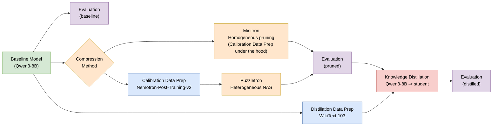

# How to Reduce Your LLM Size and Improve Efficiency with NVIDIA Model-Optimizer: A Pruning & Distillation Guide

## Table of Contents

1\. [Introduction](#1-introduction)

[Part I — Setup & Experiments](#part-i--setup--experiments)

2. [Prerequisites](#2-prerequisites)
3. [Scenario 1: Quick & Reliable Compression](#3-scenario-1-quick--reliable-compression)
4. [Scenario 2: Hardware-Constrained Compression](#4-scenario-2-hardware-constrained-compression)

[Part II — Results, Analysis & Insights](#part-ii--results-analysis--insights)

5. [Head-to-Head: When Does Each Method Win?](#5-head-to-head-when-does-each-method-win)
6. [Distillation: An Impactful Step](#6-distillation-an-impactful-step)
7. [Inference Performance](#7-inference-performance)
8. [Limitations & Practical Tips](#8-limitations--practical-tips)
9. [Open Questions](#9-open-questions)

10\. [References](#10-references)

---

## 1. Introduction

As LLMs are deployed across an ever-wider range of platforms — from cloud clusters to edge devices — the ability to produce smaller, faster models from existing ones becomes essential.
**Structural compression** (removing parameters from the model itself) is one of the most effective levers available to achieve this.

This guide walks you through two concrete scenarios for shrinking an LLM using [NVIDIA Model-Optimizer](https://github.com/NVIDIA/Model-Optimizer) (ModelOpt), each using a different compression method.

Throughout this guide, we use [**Qwen3-8B**](https://huggingface.co/Qwen/Qwen3-8B) as our base model — a dense, Transformer-based, decoder-only LLM with 8B parameters and 36 layers. All compressed variants are evaluated with [**MMLU**](https://arxiv.org/abs/2009.03300) **(5-shot)**. Companion Jupyter notebooks are provided so you can reproduce every result on this model end-to-end.

> **MMLU (Massive Multitask Language Understanding)** is a benchmark covering 57 subjects across STEM, humanities, social sciences, and more. Each question is a 4-choice multiple choice problem, giving a random baseline of 25%. The 5-shot variant provides 5 in-context examples before each question.

| | Scenario 1 | Scenario 2 |
|---|---|---|
| **Goal** | Make my general-purpose model smaller and faster, quickly and reliably | Fit a strict hardware memory budget |
| **Usecases** | Create a smaller version of the same model architecture to form a consistent family | Create a single, highly optimized deployment model that fits specific hardware budget |
| **Compression** | Light/Moderate (10–20% parameter reduction) | Aggressive (>30% memory reduction) |
| **Method** | Homogeneous Pruning ([Minitron](https://arxiv.org/abs/2408.11796)) | Heterogeneous NAS-based Pruning ([Puzzletron](https://arxiv.org/html/2411.19146v3)) |
| **Complexity** | Low — Importance-based ranking, uniform pruning | High — Fine-grained NAS search + MIP optimization |
| **Output** | Homogeneous (all Transformer blocks have the same structure) | Heterogeneous architecture (variable layer widths) |

Both paths are followed by **knowledge distillation**, which recovers accuracy lost during pruning. In our Qwen3-8B experiments, we show that significant recovery (in MMLU) is possible with as few as 100 training iterations on a small dataset, though actual recovery will vary by model and compression level.

The overall pipeline is the same for both scenarios — only the compression step differs:



### What this guide covers

- **Pruning**: structurally removing neurons, attention heads, or entire layers to produce a smaller model.
- **Distillation**: transferring knowledge from the original (teacher) model to the pruned (student) model to recover accuracy lost during pruning.

### What this guide does NOT cover

- **Quantization**: reducing numerical precision (e.g. FP16 → INT8).
- **Sparsity**: zeroing out weights while keeping the architecture.
- **MoE and hybrid architectures**: this guide focuses on dense Transformer models. For an end-to-end Minitron pruning + distillation + FP8 PTQ + vLLM deployment example on a MoE + Mamba-Transformer hybrid, see the [Nemotron-3-Nano-30B-A3B-BF16 tutorial](../../megatron_bridge/tutorials/NVIDIA-Nemotron-3-Nano-30B-A3B-BF16/README.md).

> **Note:** Pruning and quantization are complementary. After following this guide, you can further compress your pruned model with quantization for additional deployment gains.

### The two methods at a glance

**Minitron is a special case of Puzzletron**: any architecture Minitron can produce, Puzzletron can also find. Both follow the same pipeline (find a smaller architecture, then recover accuracy via distillation); they score the components of each Transformer layer (neurons, attention heads, FFN widths) and remove the ones that contribute least to the model's output. What distinguishes them is how fine-grained that search is.

- **Minitron** applies *homogeneous pruning*: the same pruning decision is applied across all layers simultaneously. The compression target is a **parameter count** (e.g. "reduce to 7B"; direct memory-budget targeting is on the Minitron roadmap). The result is a standard, smaller model with the same architecture type as the original. Fast and simple.

- **Puzzletron** applies *heterogeneous pruning* via Neural Architecture Search (NAS): it evaluates multiple candidate configurations for each layer independently (different FFN widths, optional attention removal), then uses Mixed-Integer Programming (MIP) to find the optimal per-layer combination under a given resource constraint (e.g. a **memory budget**). The result is a model where each layer can have a different structure, tailored to a specific hardware budget. More powerful, but slower.

Puzzletron's per-layer search space is much broader than Minitron's. The trade-off is complexity: Minitron is the right default for moderate, predictable, general-purpose compression; Puzzletron becomes necessary when you need to maximize accuracy under a hard hardware constraint.

### How to read this guide

- **"I need a smaller and faster general-purpose model — quickly and reliably"** → go to [Scenario 1: Quick & Reliable Compression (Section 3)](#3-scenario-1-quick--reliable-compression).
- **"I must fit a strict memory budget"** → go to [Scenario 2: Hardware-Constrained Compression (Section 4)](#4-scenario-2-hardware-constrained-compression).
- **"Which method should I use?"** → read end-to-end. Section 5 compares both methods head-to-head.

**Guide organization:** This guide is split into two parts. **Part I — Setup & Experiments** (Sections 2–4) covers the technicalities needed to reproduce the experiments: environment setup and step-by-step walkthroughs for each scenario. **Part II — Results, Analysis & Insights** (Sections 5–9) focuses on what those experiments reveal: a head-to-head comparison, a deep dive into distillation, inference benchmarks, practical tips and limitations, and open questions for future work.

> **Note on reproducibility:** All experiments in this guide were run on the [NeMo container 26.02](https://catalog.ngc.nvidia.com/orgs/nvidia/containers/nemo?version=26.02.00) with `nvidia-modelopt` 0.43.0. The pruning frameworks and scoring mechanisms used by Minitron and Puzzletron are under active development. As ModelOpt evolves, exact evaluation numbers may differ from one release to another. The trends and comparative insights presented in this guide (which method wins in which regime, how distillation behaves, and the accuracy-compression trade-offs) are expected to remain consistent.

---

<a id="part-i--setup--experiments"></a>

## Part I — Setup & Experiments

---

## 2. Prerequisites

### Hardware

All experiments in this guide were run on **2x H200 GPUs**. This can be adapted to different GPU counts and types depending on your setup. Adjust tensor/pipeline parallelism and batch size accordingly.

> **Architecture requirement:** The NeMo container and ModelOpt scripts used in this guide require an **x86-64 (AMD64)** host.

### Clone ModelOpt

Clone the ModelOpt repository on your host machine. It will be mounted into the container in the next step, so any changes you make to the source persist across sessions:

```bash
export MODELOPT_DIR=${PWD}/Model-Optimizer
git clone https://github.com/NVIDIA/Model-Optimizer.git ${MODELOPT_DIR}
chmod -R 777 ${MODELOPT_DIR}
```

> **Permissions:** The `chmod -R 777` ensures the container (running as root) can write to the mounted directory.

### Container

> **Setup source of truth:** ModelOpt evolves quickly. The instructions below reflect the setup used at the time this guide was written and are provided as a working example. For the most up-to-date container version and installation steps, refer to:
> [megatron_bridge/README.md](https://github.com/NVIDIA/Model-Optimizer/blob/main/examples/megatron_bridge/README.md)

We use the [NVIDIA NeMo Framework Docker container (26.02)](https://catalog.ngc.nvidia.com/orgs/nvidia/containers/nemo?version=26.02.00), which includes all the libraries needed pre-installed (including [Megatron-Bridge](https://github.com/NVIDIA-Nemo/Megatron-Bridge) — NVIDIA's library that bridges HuggingFace models with the Megatron-core framework, enabling efficient multi-GPU distillation).

You need [Docker](https://docs.docker.com/get-docker/) and the [NVIDIA Container Toolkit](https://docs.nvidia.com/datacenter/cloud-native/container-toolkit/install-guide.html) to enable GPU access inside containers.

Launch the container with the cloned repo mounted at `/opt/Model-Optimizer`:

```bash
docker run \
    --gpus all \
    --shm-size=16GB \
    --net=host \
    --ulimit memlock=-1 \
    --rm -it \
    -v ${MODELOPT_DIR}:/opt/Model-Optimizer \
    -w /workspace \
    nvcr.io/nvidia/nemo:26.02 bash -c "umask 000 && exec bash"
```

### Install dependencies

Once inside the container, uninstall the pre-existing `nvidia-modelopt`, `lm_eval`, and `nvidia_lm_eval` so they don't cause version conflicts. Then install ModelOpt from the cloned repo as an editable package with the `hf` and `puzzletron` extras, and add the extra Puzzletron-example dependencies (which include `lm-eval` for benchmark evaluation). Together these steps cover the dependencies for all scenarios in this guide:

```bash
/usr/bin/python3 -m pip uninstall -y nvidia-modelopt
python -m pip uninstall -y lm_eval nvidia_lm_eval
cd /opt/Model-Optimizer && python -m pip install -e ".[hf,puzzletron]"
python -m pip install -r /opt/Model-Optimizer/examples/puzzletron/requirements.txt
```

### Base model

We use [Qwen3-8B](https://huggingface.co/Qwen/Qwen3-8B) as our base model throughout this guide. It is a dense, decoder-only Transformer with the following architecture:

| Layers | Hidden size | FFN intermediate size | Attention heads (Q) | KV heads (GQA) | Parameters |
|---|---|---|---|---|---|
| 36 | 4096 | 12288 | 32 | 8 | ~8B |

Each Transformer block has two components, both of which are targeted by the compression methods in this guide:

- **Attention (GQA — Grouped Query Attention):** Computes contextual relationships between tokens. Qwen3-8B uses 8 shared KV heads for 32 query heads, which reduces the KV cache. Puzzletron can remove attention entirely from selected layers, making it the primary lever for memory reduction.
- **FFN (Feed-Forward Network):** A per-token MLP applied after attention. The intermediate size (12288) controls its capacity. Puzzletron can reduce this per layer; Minitron reduces it uniformly across all layers.

Authenticate with HuggingFace and download Qwen3-8B:

```bash
hf auth login --token <your_token>
hf download Qwen/Qwen3-8B --local-dir /workspace/models/Qwen3-8B
```

### Companion notebooks

| Notebook | Description | Runtime (2x H200) |
|---|---|---|
| [`00_prerequisites.ipynb`](00_prerequisites.ipynb) | Prepare the data + Baseline evaluation | ~15 min |
| [`scenario1_minitron.ipynb`](scenario1_minitron.ipynb) | Scenario 1 — Minitron | ~1h45 |
| [`scenario1_puzzletron.ipynb`](scenario1_puzzletron.ipynb) | Scenario 1 — Puzzletron | ~6h (on first Puzzletron run) |
| [`scenario2_minitron.ipynb`](scenario2_minitron.ipynb) | Scenario 2 — Minitron | ~45 min |
| [`scenario2_puzzletron.ipynb`](scenario2_puzzletron.ipynb) | Scenario 2 — Puzzletron | ~6h15 (on first Puzzletron run) |

From within the container, run the notebooks directly from the mounted ModelOpt repo so any edits you make persist on your host machine. Start Jupyter Lab in the notebook directory:

```bash
cd /opt/Model-Optimizer/examples/pruning/minitron_vs_puzzletron
pip install --upgrade ipywidgets notebook
jupyter lab --ip 0.0.0.0 --port=8888 --allow-root
```

---

## 3. Scenario 1: Quick & Reliable Compression

> *"I need a smaller and faster general-purpose model — quickly and reliably."*

You have a working LLM and want to reduce its size by up to 20% (in number of parameters) for general-purpose tasks. You need a straightforward pipeline with predictable results and a standard, homogeneous model as output. You don't want to invest time experimenting and familiarizing with a complex pipeline or dealing with heterogeneous model formats.

**Minitron** is the right tool for this job.

### 3.1 When to choose this path

- Your compression target is **moderate** (10–20% reduction in number of parameters).
- You want a **simple, fast pipeline**: prune → distill → deploy.
- You need a **standard/homogeneous model** as output (same architecture type, just smaller).
- You value **predictability**: Minitron's importance-based ranking produces consistent results.
- You are not targeting a specific downstream task (**general-purpose** compression).

**Examples:**
- You're serving a 70B model on 4x H100s via TensorRT-LLM. Pruning it to ~56B lets you serve on 2x H100s with the same architecture, cutting your GPU cost in half overnight.
- Your team maintains one large base model and needs to quickly ship multiple size variants (e.g. 8B / 7B / 6B) for different customer SLAs. Minitron lets you derive them all from the same checkpoint with a single script, instead of training each variant independently.

### 3.2 How Minitron works

Minitron compresses a model in two stages:

**Stage 1 — Importance-based pruning.** Minitron supports two complementary pruning strategies:

- **Depth pruning**: removes entire Transformer layers. Layers are ranked by *perplexity-based scoring* or *block importance* (measuring each layer's contribution to the model's output), and the least important ones are dropped.
- **Width pruning**: reduces the dimensions within each layer uniformly. Neurons and heads are ranked by *activation-based importance scoring* during a calibration pass, and the lowest-ranked ones are removed across all layers.

Both strategies can be combined. An optional automatic NAS search can be enabled to explore the space of (depth, width) configurations and select the best one for a given parameter target. The result is a standard, homogeneous model.

**Stage 2 — Knowledge distillation.** The pruned model (student) is trained to mimic the original model (teacher) using logits-based KL divergence loss.

### 3.3 Walkthrough: Qwen3-8B → 7B parameters

**→ Data preparation:** Run notebook [`00_prerequisites.ipynb`](00_prerequisites.ipynb) to prepare the data and evaluate the original model.

**→ Minitron pruning and distillation:** Run notebook [`scenario1_minitron.ipynb`](scenario1_minitron.ipynb) for the full end-to-end pipeline (prune → distill → evaluate).

#### Results

| Model | Layers | Hidden Size | FFN Intermediate | Parameters | MMLU (5-shot) | % of Teacher |
|---|---|---|---|---|---|---|
| Qwen3-8B (teacher) | 36 | 4096 | 12288 | 8B | 0.7493 | 100% |
| Minitron — pruned | 32 | 3840 | 12288 | 6.96B | 0.7038 | 93.9% |
| Minitron — pruned + distilled | 32 | 3840 | 12288 | 6.96B | **0.7166** | **95.6%** |

Distillation recovers **+1.28 percentage points** of MMLU accuracy with just 100 iterations on [WikiText-103](https://huggingface.co/datasets/Salesforce/wikitext/tree/main/wikitext-103-v1).

### 3.4 Comparison with Puzzletron at the same parameter target

To validate that Minitron is the right choice for this scenario, we also ran Puzzletron at the same ~7B parameter target. Puzzletron produces a 36-layer heterogeneous model with variable FFN widths per layer (some as low as 2560) and selective attention removal.

→ See notebook [`scenario1_puzzletron.ipynb`](scenario1_puzzletron.ipynb) to reproduce this run.

| Model | Parameters | MMLU (pruned) | MMLU (distilled) | % of Teacher |
|---|---|---|---|---|
| **Minitron 7B** | 6.96B | 0.7038 | **0.7166** | **95.6%** |
| Puzzletron 7B | 6.99B | 0.6621 | 0.6823 | 91.1% |

**Minitron wins on MMLU by +3.43 percentage points after distillation.**

> **Note on Puzzletron search space:** The Puzzletron run above used a limited search space. A broader search (more FFN size candidates, more block variants) could potentially find better architectures; but this comes at a cost. Each additional candidate increases scoring time, calibration GPU hours, and MIP complexity. At moderate compression targets, the marginal gains from expanding the search are unlikely to justify the additional pipeline complexity and compute investment. This is precisely where Minitron's simplicity shines.

**Takeaway:** For moderate, general-purpose compression where you want reliability and simplicity, Minitron is the practical default — it delivers strong accuracy on general knowledge benchmarks like MMLU, with a simpler pipeline and a standard model format.

> **Important Note (benchmark-dependent behavior):** The comparison above uses MMLU only (general-purpose). On other benchmarks, the ranking between Minitron and Puzzletron can flip at this compression level. See [Section 5.4](#54-benchmark-specific-behavior) for a full multi-benchmark analysis, especially if your use case targets a specific downstream task.

---

## 4. Scenario 2: Hardware-Constrained Compression

> *"I must fit a strict memory budget."*

You need to deploy an LLM on hardware with a hard memory ceiling (an edge device like NVIDIA Jetson, a specific GPU with limited VRAM, etc.). The compression is aggressive (>20%), and you are willing to invest in a more complex pipeline to squeeze the best possible accuracy out of your budget.

**Puzzletron** is the right tool for this job.

### 4.1 When to choose this path

- You have a **hard hardware constraint** expressed as a memory budget (e.g. "must fit within 78,000 MiB").
- Your compression target is **aggressive** (>20% reduction).
- You are willing to invest in a **more complex pipeline** (NAS search, MIP optimization) to maximize accuracy within the constraint.
- A **heterogeneous model** (different layer widths, selective attention removal) is acceptable for your deployment.

**Examples:**
- You need to deploy an 8B model on an edge device such as an NVIDIA Jetson AGX Orin (64 GB). Puzzletron can target the exact memory budget your application allows.
- You're building a latency-optimized model for real-time inference where removing attention from certain layers directly reduces compute per token, and you want NAS to find the optimal trade-off automatically.

### 4.2 How Puzzletron works

Puzzletron compresses a model through an automated NAS pipeline:

**Step 1 — Build a replacement library.** For each Transformer layer, Puzzletron generates a set of candidate block variants: the original block, blocks with reduced FFN widths (e.g. 10240, 8192, 5120, 2560), and blocks with attention removed entirely. Each variant is scored for quality and cost (memory footprint, parameter count, ...).

**Step 2 — MIP optimization.** A Mixed-Integer Program takes the full library of per-layer candidates and their quality/cost scores, and finds the optimal combination that minimizes total quality loss subject to the target constraints (e.g. memory ≤ 78,000 MiB). This is what makes Puzzletron *heterogeneous*: the solver can choose a different configuration for every layer.

**Step 3 — Knowledge distillation.** Same as Minitron: the assembled heterogeneous model (student) is distilled against the original model (teacher) using logits-based KL divergence loss.

### 4.3 Walkthrough: Qwen3-8B - 126,215 MiB → 78,000 MiB memory target

**→ Data preparation:** Run notebook [`00_prerequisites.ipynb`](00_prerequisites.ipynb) to prepare the data and evaluate the original model (if not already done).

**→ Puzzletron NAS and distillation:** Run notebook [`scenario2_puzzletron.ipynb`](scenario2_puzzletron.ipynb) for the full end-to-end pipeline (prune → NAS search → distill → evaluate).

#### Results

| Model | Layers | Memory Footprint | MMLU (5-shot) | % of Teacher |
|---|---|---|---|---|
| Qwen3-8B (teacher) | 36 | 126,215 MiB | 0.7493 | 100% |
| Puzzletron — pruned | 36 | 77,992 MiB | 0.2752 | 36.7% |
| Puzzletron — pruned + distilled | 36 | 77,992 MiB | **0.5613** | **74.9%** |

The pre-distillation accuracy is near-random (MMLU has a 25% baseline for 4-choice questions); this is expected at >35% compression. Distillation recovers **+28.61 percentage points**, transforming a non-functional model into a usable one.

<details>
<summary><b>Puzzletron architecture details</b> — per-layer block configuration (click to expand)</summary>

```text
block_0:   attention  kv_heads_8    ffn  intermediate_12288
block_1:   attention  kv_heads_8    ffn  intermediate_5120
block_2:   attention  kv_heads_8    ffn  intermediate_5120
block_3:   attention  kv_heads_8    ffn  intermediate_7424
block_4:   attention  no_op         ffn  intermediate_9984
block_5:   attention  no_op         ffn  intermediate_9984
block_6:   attention  kv_heads_8    ffn  intermediate_12288
block_7:   attention  no_op         ffn  intermediate_9984
block_8:   attention  no_op         ffn  intermediate_9984
block_9:   attention  no_op         ffn  intermediate_9984
block_10:  attention  no_op         ffn  intermediate_12288
block_11:  attention  no_op         ffn  intermediate_12288
block_12:  attention  kv_heads_8    ffn  intermediate_12288
block_13:  attention  kv_heads_8    ffn  intermediate_12288
block_14:  attention  kv_heads_8    ffn  intermediate_12288
block_15:  attention  kv_heads_8    ffn  intermediate_12288
block_16:  attention  no_op         ffn  intermediate_9984
block_17:  attention  kv_heads_8    ffn  intermediate_12288
block_18:  attention  kv_heads_8    ffn  intermediate_12288
block_19:  attention  kv_heads_8    ffn  intermediate_12288
block_20:  attention  no_op         ffn  intermediate_7424
block_21:  attention  kv_heads_8    ffn  intermediate_12288
block_22:  attention  kv_heads_8    ffn  intermediate_12288
block_23:  attention  kv_heads_8    ffn  intermediate_12288
block_24:  attention  kv_heads_8    ffn  intermediate_12288
block_25:  attention  no_op         ffn  intermediate_12288
block_26:  attention  no_op         ffn  intermediate_12288
block_27:  attention  no_op         ffn  intermediate_12288
block_28:  attention  no_op         ffn  intermediate_12288
block_29:  attention  kv_heads_8    ffn  intermediate_12288
block_30:  attention  no_op         ffn  intermediate_12288
block_31:  attention  no_op         ffn  intermediate_12288
block_32:  attention  kv_heads_8    ffn  intermediate_12288
block_33:  attention  kv_heads_8    ffn  intermediate_12288
block_34:  attention  kv_heads_8    ffn  intermediate_12288
block_35:  attention  kv_heads_8    ffn  intermediate_9984
```

</details>

### 4.4 Comparison with Minitron at the same memory target

To validate that Puzzletron is the right choice for this scenario, we also ran Minitron at the same memory budget. To match ~78,000 MiB, Minitron drops 14 of 36 layers (keeping 22), producing a 5.49B parameter model.

→ See notebook [`scenario2_minitron.ipynb`](scenario2_minitron.ipynb) to reproduce this run.

| Model | Memory Footprint | MMLU (pruned) | MMLU (distilled) | % of Teacher |
|---|---|---|---|---|
| **Puzzletron 78k** | 77,992 MiB | 0.2752 | **0.5613** | **74.9%** |
| Minitron 78k | 78,054 MiB | 0.2351 | 0.4620 | 61.7% |

**Puzzletron wins on MMLU by +9.93 percentage points after distillation.**

At this extreme compression level, Minitron's strategy of dropping entire layers removes too many reasoning pathways. Puzzletron's approach (keeping all 36 layers but surgically thinning them) preserves the model's depth and gives distillation more structure to work with.

**Takeaway:** For aggressive compression under a hard memory constraint, Puzzletron's heterogeneous NAS consistently outperforms Minitron's uniform pruning. The additional pipeline complexity is justified by a significant accuracy advantage.

> **Important Note (benchmark-dependent behavior):** The comparison above uses MMLU only. On other benchmarks, the ranking between Minitron and Puzzletron can flip. However, at this aggressive compression level, our experiments show that Puzzletron wins across the board, outperforming Minitron on every benchmark we evaluated. See [Section 5.4](#54-benchmark-specific-behavior) for the full multi-benchmark results.

---

<a id="part-ii--results-analysis--insights"></a>

## Part II — Results, Analysis & Insights

---

## 5. Head-to-Head: When Does Each Method Win?

Sections 3 and 4 (Part I) showed the recommended method for each scenario. Here we consolidate all results to reveal the full picture.

### 5.1 Summary of all experiments

| Compression Target | Method | Parameters | Memory | MMLU (pruned) | MMLU (distilled) | % of Teacher |
|---|---|---|---|---|---|---|
| **7B params (~14%)** | **Minitron** | **6.96B** | **111,570 MiB** | **0.7038** | **0.7166** | **95.6%** |
| 7B params (~14%) | Puzzletron | 6.99B | 123,929 MiB | 0.6621 | 0.6823 | 91.1% |
| **78,000 MiB (~38%)** | **Puzzletron** | **7.07B** | **77,992 MiB** | **0.2752** | **0.5613** | **74.9%** |
| 78,000 MiB (~38%) | Minitron | 5.49B | 78,054 MiB | 0.2351 | 0.4620 | 61.7% |

### 5.2 Why each method wins in its regime

In theory, Minitron is a subset of Puzzletron: any architecture Minitron can find, Puzzletron could also find if its search space were large enough. But the search space must be finite, and expanding it comes with significant compute and complexity costs. This is why both methods have their sweet spot.

**Scenario 1 (moderate compression):**

On MMLU, Minitron outperforms Puzzletron at this level (+3.43pp post-distill). Its uniform pruning directly targets a parameter count, produces a clean architecture in a single step, and avoids the complexity of a full NAS pipeline. At the same time, this advantage is benchmark-dependent: on other benchmarks, Puzzletron could retain more of the teacher's accuracy than Minitron (see [Section 5.4](#54-benchmark-specific-behavior)). This means there is no single-bullet approach: different compression methods have their winning territories even at moderate compression. That said, when factoring in pipeline complexity and the standard model format Minitron produces, it remains the practical default for most general-purpose compression needs at this level.

Moreover, Minitron can be applied **iteratively**: for example, prune 20%, distill, then prune another 20% and distill again. This staged schedule typically preserves more quality than a single, more aggressive pruning step at the same overall parameter reduction.

**Scenario 2 (aggressive memory compression):**

Puzzletron becomes essential. When the target is a hard memory budget, Puzzletron can optimize for it directly via MIP constraints, whereas Minitron optimizes for a parameter count, and mapping parameter targets to memory budgets is indirect and suboptimal. More importantly, at this level of compression, Minitron acts like a butcher (dropping entire layers), while Puzzletron acts like a surgeon (selectively thinning FFN widths and removing attention per-layer). The surgical approach preserves far more model structure, giving distillation more to work with. This is why Puzzletron recovers to 74.9% of the teacher vs. Minitron's 61.7%.

### 5.3 Accuracy vs. compression


### 5.4 Benchmark-specific behavior

The MMLU-based comparisons in Sections 3–4 and the summary table above tell only part of the story. Evaluating the same compressed models on [HellaSwag](https://arxiv.org/abs/1905.07830) (commonsense reasoning) and [GSM8K](https://arxiv.org/abs/2110.14168) (math reasoning) reveals that **the best compression method depends on the benchmark**.

**Scenario 1 — 7B parameter target (% of teacher, post-distillation)**

| Benchmark | Minitron 7B | Puzzletron 7B | Winner |
|---|---|---|---|
| MMLU | **95.6%** | 91.1% | **Minitron** |
| HellaSwag acc_norm | 88.3% | **91.4%** | **Puzzletron** |
| GSM8K strict | 83.1% | **92.8%** | **Puzzletron** |

**Scenario 2 — 78,000 MiB memory target (% of teacher, post-distillation)**

| Benchmark | Puzzletron 78k | Minitron 78k | Winner |
|---|---|---|---|
| MMLU | **74.9%** | 61.7% | **Puzzletron** |
| HellaSwag acc_norm | **87.7%** | 64.4% | **Puzzletron** |
| GSM8K strict | **53.2%** | 3.7% | **Puzzletron** |

Several observations stand out:

**At moderate compression, the winner depends on the benchmark:** In Scenario 1, the picture is benchmark-dependent: Minitron leads on MMLU (~96% vs. ~91% of teacher), while Puzzletron leads on HellaSwag acc_norm (~91% vs. ~88%) and GSM8K (~93% vs. ~83%), suggesting the additional pipeline complexity may not be warranted for general-purpose compression, though heterogeneous pruning appears to better preserve reasoning capabilities. There is no single-bullet approach: different compression algorithms have their winning territories, and pipeline complexity should also be taken into account.

**At aggressive compression, Puzzletron wins across the board:** In Scenario 2, there is no benchmark where Minitron comes close. The advantage is especially stark on GSM8K, where Minitron retains only 3.7% of the teacher's accuracy vs. Puzzletron's 53.2%. This suggests that per-layer selective pruning keeps critical reasoning pathways that Minitron's uniform approach removes.

> **Note:** The companion notebooks reproduce only the MMLU evaluations end-to-end. The HellaSwag and GSM8K results reported here were obtained using the same `lm-eval` harness on the same compressed checkpoints.

### 5.5 Extra insights: accuracy across the full memory compression spectrum

The two scenarios in this guide represent two specific points on a continuous compression curve. Complementary experiments using Puzzletron's MIP sweep mode (which re-runs the MIP solver across multiple memory targets without repeating the full NAS pipeline) allowed us to sample additional points and compare both methods side-by-side across the full spectrum.

<details>
<summary>Click to expand — chart + observations across the full compression spectrum</summary>


Several observations stand out:

**At 90% memory, both methods are nearly equivalent.** Post-distillation accuracy is 0.7415 (Minitron) vs. 0.7406 (Puzzletron); a 0.1pp gap that is well within noise. At this compression level, Minitron's simplicity makes it the clear practical choice.

**At 80% memory, Minitron wins post-distillation, despite losing pre-distillation.** Before distillation, Puzzletron (0.5910) leads Minitron (0.5084) by +8.3pp. After distillation, Minitron (0.7302) overtakes Puzzletron (0.6921) by +3.8pp. This is a concrete example of the architecture ranking flip described in [Section 6.4](#64-architecture-ranking-can-flip-after-distillation).

**The crossover point lies somewhere between 20% and 38% compression.** Below ~20% compression, Minitron consistently wins post-distillation. Beyond ~38%, Puzzletron pulls decisively ahead. The exact crossover will depend on the model, the distillation budget, and the Puzzletron search space — but this range provides a practical guideline.

</details>

### 5.6 Decision rules

| If... | Then use... |
|---|---|
| Compression is <20% and general-purpose | **Minitron** |
| You need a standard/homogeneous model | **Minitron** |
| Compression is >20% | **Puzzletron** |
| You have a hard memory budget | **Puzzletron** |
| You want minimal pipeline complexity | **Minitron** |
| You want maximum accuracy at any cost | **Puzzletron** |

---

## 6. Distillation: An Impactful Step

### 6.1 Why distillation matters for both methods

Pruning removes parameters, but the remaining weights were trained in the context of the full model. They don't "know" their neighbors have been removed. Distillation re-aligns the pruned model's representations with the teacher's, allowing it to recover accuracy by learning to produce similar output distributions.

This applies equally to Minitron and Puzzletron. Regardless of how the model was pruned (uniformly or heterogeneously), the student benefits from being guided by the teacher's logits.

### 6.2 How little data you actually need

In our Qwen3-8B experiments, we used a deliberately minimal distillation setup:

| Parameter | Value |
|---|---|
| Dataset | WikiText-103 (train split) |
| Iterations | 100 |
| Tokens processed | ~1.6M |

The results were remarkable: +1.28pp to +28.61pp of MMLU recovery depending on the compression level, using a small generic dataset and just 100 iterations. Note that more extensive distillation (using more iterations, larger datasets, or higher-quality data such as [Nemotron-Post-Training-Dataset-v2](https://huggingface.co/datasets/nvidia/Nemotron-Post-Training-Dataset-v2)) can enable further recovery.

> **Important caveat:** This fast convergence is specific to Qwen3-8B and should not be generalized. In other settings, distillation may require billions of tokens and thousands of iterations to converge. The Qwen3-8B result demonstrates that distillation can be surprisingly efficient, but your mileage will vary. Always monitor loss curves to verify convergence before stopping training.

### 6.3 Distillation loss curves

The plot below shows the training and validation distillation loss (KL divergence) for both methods at the 7B parameter target:


Both curves converge smoothly, with Puzzletron maintaining a consistently lower loss throughout: its heterogeneous architecture preserves more of the original model's behavior, even though it ultimately scores lower on MMLU (0.6823 vs. 0.7166). This confirms that **distillation loss alone does not predict downstream task accuracy**.

### 6.4 Architecture ranking can flip after distillation

An important insight: **the architecture that looks best before distillation is not necessarily the one that recovers best after distillation.** The 80% memory case in [Section 5.5](#55-extra-insights-accuracy-across-the-full-memory-compression-spectrum) is a concrete example: Puzzletron's pruned model leads Minitron by +8.3pp before distillation, yet Minitron overtakes it by +3.8pp after. More generally, we observed this ranking reversal at multiple compression levels.

A promising improvement to address this is **Blockwise Local Distillation (BLD)**. BLD locally trains block variants *before* the MIP assembly step, so the search prefers blocks that are "distillable" and compatible after reassembly, not just blocks that look good as immediate swaps. The experiments in this guide did not use BLD; adding it on top of the Puzzletron pipeline described here is expected to further improve post-distillation accuracy.

---

## 7. Inference Performance

Sections 5 and 6 focused on accuracy. But for deployment, throughput and latency matter just as much. Here we benchmark all compressed models from Scenarios 1 and 2 on a single GPU using [vLLM](https://docs.vllm.ai) and compare their serving performance against the original Qwen3-8B.

### 7.1 Experiment setup

**vLLM with AnyModel support:** Serving Puzzletron's heterogeneous architectures requires vLLM's new `AnyModel` backend, which adds generic support for Puzzletron-optimized models with per-layer varying widths and selective attention removal. This feature is currently available via a [pull request](https://github.com/vllm-project/vllm/pull/36512) and is expected to land in a future vLLM release. Minitron models and the baseline use standard vLLM  (no special support needed).

**Benchmarking tool:** We use [AIPerf](https://github.com/ai-dynamo/aiperf) to profile each model at increasing concurrency levels (1, 4, 8, 16, 32, 64, 128 concurrent requests).

**Workload:** Each request sends ~1,000 input tokens and generates ~200 output tokens, simulating a summarization-style use case.

**Hardware:** 1x NVIDIA H200 NVL GPU.

**Models benchmarked (all post-distillation):** Qwen3-8B (baseline), Minitron 7B (Scenario 1), Puzzletron 7B (Scenario 1), Minitron 78k (Scenario 2), Puzzletron 78k (Scenario 2)

> **How to reproduce:** Serving Puzzletron's heterogeneous models with vLLM requires a few extra setup steps. See [Appendix](#appendix-serving-a-puzzletron-model-with-vllm) for the full procedure.

### 7.2 Results


Results shown in the table at concurrency 64 (near-saturated throughput). Full curves across all concurrency levels are in the chart above.

| Scenario | Model | Throughput (tok/s) | Mean TPOT (ms) | P99 TPOT (ms) | Mean TTFT (ms) |
|---|---|---|---|---|---|
| — | **Qwen3-8B (baseline)** | 218.9 | 267.81 | 321.63 | 2,426.40 |
| Scenario 1 (7B params) | **Minitron 7B** | 246.7 | 243.15 | 293.74 | 2,229.41 |
| Scenario 1 (7B params) | **Puzzletron 7B** | 219.2 | 267.87 | 321.93 | 2,428.24 |
| Scenario 2 (78k MiB) | **Minitron 78k** | 364.0 | 160.99 | 195.01 | 1,496.71 |
| Scenario 2 (78k MiB) | **Puzzletron 78k** | 370.5 | 158.41 | 192.21 | 1,516.35 |

> **Metrics glossary:** **Throughput** = output tokens generated per second across all concurrent requests. **TPOT** (Time Per Output Token) = inter-token latency, i.e. how long between consecutive tokens in a single response. **TTFT** (Time To First Token) = how long until the first token is generated after a request is submitted.

### 7.3 Analysis & Insights

**At moderate compression (Scenario 1), Minitron delivers a clear inference speedup; Puzzletron does not.**

Minitron 7B reaches ~13% higher peak throughput than the baseline and ~15% lower single-request latency. Puzzletron 7B, by contrast, is nearly indistinguishable from the baseline (~2% throughput improvement). This makes sense: Minitron's homogeneous architecture (fewer layers and a uniformly smaller hidden size) translates directly into less compute per forward pass. Puzzletron keeps all 36 layers and varies FFN widths per layer; the irregular structure offers less opportunity for the runtime to optimize.

Combined with the accuracy results from [Section 5](#5-head-to-head-when-does-each-method-win), Minitron wins both on MMLU accuracy and inference speed at this compression level — reinforcing it as the practical default for moderate, general-purpose compression.

**At aggressive compression (Scenario 2), both methods deliver massive speedups, and Puzzletron beats Minitron on throughput while preserving far more accuracy.**

Both Scenario 2 models dramatically outperform the baseline: Minitron 78k reaches 364 tok/s and Puzzletron 78k reaches 371 tok/s at concurrency 64 — a ~66–69% improvement over the baseline's 219 tok/s. On single-request latency, Minitron 78k is slightly faster (6.15 ms vs. 7.21 ms TPOT at concurrency 1), but the gap narrows under load and Puzzletron edges ahead on peak throughput.

The key insight is the accuracy-performance trade-off: Puzzletron 78k retains 74.9% of teacher MMLU vs. Minitron 78k's 61.7% (similar pattern across other benchmarks) while delivering slightly better throughput. At this compression level, Puzzletron gives you more accuracy *and* more throughput.

> **Coming soon: optimizing directly for throughput and latency.** The experiments above use Puzzletron with a memory or parameter count target: the MIP solver maximizes a quality score subject to these resource budgets. An upcoming Puzzletron feature will allow optimizing directly for inference throughput or latency as the primary constraint, enabling the MIP solver to find architectures that are not just memory-efficient but also maximally fast to serve. Early results show that this inference-aware optimization provides significant accuracy gains over memory-targeted compression at the same latency level.

---

## 8. Limitations & Practical Tips

### 8.1 Limitations of this guide

- **Single base model:** All experiments use Qwen3-8B. Results (especially distillation convergence speed and the crossover point between Minitron and Puzzletron) may differ on other models and model families.
- **Limited benchmarks:** The notebooks reproduce MMLU end-to-end. Supplementary evaluations on HellaSwag and GSM8K (see [Section 5.4](#54-benchmark-specific-behavior)) confirm that the best method is benchmark-dependent, but three benchmarks on one model are not enough to build general per-task guidelines.
- **Minimal distillation:** 100 iterations on WikiText-103 is a lower bound. Production deployments should use more iterations, larger datasets, and a curated data blend (e.g. Nemotron pretraining + post-training mix). See the [Nemotron-3-Nano-30B-A3B-BF16 Data Preparation guide](../../megatron_bridge/tutorials/NVIDIA-Nemotron-3-Nano-30B-A3B-BF16/README.md#1-data-preparation) for a worked example, and [`MEGATRON_DATA_PREP.md`](../../dataset/MEGATRON_DATA_PREP.md) for tokenization commands.
- **Fixed search space for Puzzletron:** The NAS search space (FFN candidate sizes, attention removal options) was kept small for tractability. A broader search space could yield better architectures at the cost of longer search time.
- **Single-step Minitron:** We use a one-shot Minitron configuration rather than a multi-step iterative scheme, which simplifies the pipeline but typically achieves less compression and leaves some potential quality–compression gains on the table.

### 8.2 Practical tips

- **Start with Minitron:** If you're unsure which method to use, start with Minitron. It's faster to set up, produces a standard model, and gives you a strong baseline. You can always run Puzzletron afterward if you need more aggressive compression.
- **Distillation is not optional:** At any compression level beyond ~10%, always distill. The accuracy gain can be substantial.
- **Combine with quantization:** After pruning and distillation, you can further compress your model with quantization (e.g. FP8, NVFP4). The two techniques are complementary: pruning reduces the architecture, quantization reduces the precision.
- **Monitor memory, not just parameters:** Two models with the same parameter count can have very different memory footprints. Puzzletron's memory-aware MIP handles this directly; with Minitron, verify your memory budget manually after pruning.

### 8.3 Deployment considerations for heterogeneous architectures

Puzzletron produces models with per-layer varying FFN widths and selective attention removal. vLLM recently added support for these architectures via the `AnyModel` backend (see [Section 7](#7-inference-performance) for benchmarks and setup instructions). As of this writing, this support is available via an [open pull request](https://github.com/vllm-project/vllm/pull/36512) and is expected to be merged into mainline vLLM in a future release. Other inference engines (TensorRT-LLM, etc.) do not yet support heterogeneous architectures. Minitron models, being homogeneous, are deployable on any standard inference stack today.

---

## 9. Open Questions

The experiments in this guide raise new questions to investigate. Below are directions we find promising for future work.

**Combining Minitron depth pruning with Puzzletron width pruning.**
In this guide, Minitron and Puzzletron are used independently. A natural next step is to combine them: first use Minitron to remove the least important layers (depth pruning), then apply Puzzletron's per-layer NAS to the remaining layers (heterogeneous width pruning). This two-stage approach could achieve more aggressive compression than either method alone: Minitron reduces the layer count quickly and cheaply, while Puzzletron fine-tunes the surviving layers to fit a precise hardware budget.

**Model and scale sensitivity: do we need model-specific compression guidelines?**
All our results come from a single model (Qwen3-8B). Do other architectures or model sizes respond differently to Minitron and Puzzletron? For instance, does the crossover point between the two methods shift for larger models (70B+) or for architectures with different attention patterns (e.g. GQA vs. MHA, MoE vs. dense)?

**Distillation recipe: how to choose the dataset, duration, and scale?**
Our experiments used 100 iterations on WikiText-103, a deliberately minimal setup that happened to work well for Qwen3-8B. But how should one choose the distillation dataset (generic vs. domain-specific?), the number of iterations, and the token budget for a new model? Is there a principled way to estimate the required distillation effort given a model and compression level, or does it always require empirical tuning?
> For a concrete recipe and detailed ablations on data blend, token budget, and convergence (on Nemotron-3-Nano-30B-A3B-BF16, an MoE + Mamba-Transformer hybrid), see the [Nemotron-3-Nano-30B-A3B-BF16 tutorial](../../megatron_bridge/tutorials/NVIDIA-Nemotron-3-Nano-30B-A3B-BF16/README.md) and its [blend / long-context / pruning ablations](../../megatron_bridge/tutorials/NVIDIA-Nemotron-3-Nano-30B-A3B-BF16/ABLATIONS.md).

**Serving heterogeneous architectures: how to balance Tensor Parallelism and Pipeline Parallelism?**
Puzzletron produces models where layers have different widths and some lack attention entirely. Standard TP/PP strategies assume uniform layers. How should parallelism be partitioned when layer costs vary significantly? Finding efficient serving configurations for heterogeneous architectures is an open problem that directly impacts their practical deployment.

**Benchmark-specific behavior: can we build guidelines per downstream task?**
As shown in [Section 5.4](#54-benchmark-specific-behavior), the relative ranking of compressed models shifts depending on the benchmark. Can we identify which compression strategies preserve which capabilities? Our experiments on MMLU, HellaSwag, and GSM8K suggest that Minitron's depth pruning better preserves general knowledge while Puzzletron's heterogeneous pruning better preserves reasoning, but three benchmarks on one model are not enough to generalize.

> **Going further:** To explore these questions, see [Advanced Compression Experiments: Results & Insights](advanced_compression_experiments.md), which gathers the results and insights from more sophisticated experiments.

---

## 10. References

- **Minitron:** Sreenivas et al., [*Compact Language Models via Pruning and Knowledge Distillation*](https://arxiv.org/abs/2407.14679), 2024.
- **More Minitron Results:** Sreenivas et al., [*LLM Pruning and Distillation in Practice: The Minitron Approach*](https://arxiv.org/pdf/2408.11796), 2024.
- **Puzzletron:** Bercovich et al., [*Puzzle: Distillation-Based NAS for Inference-Optimized LLMs*](https://arxiv.org/abs/2411.19146), 2024.
- **NVIDIA ModelOpt:** [GitHub Repository](https://github.com/NVIDIA/Model-Optimizer)
- **Llama Puzzletron Tutorial:** [Puzzletron Example on ModelOpt](https://github.com/NVIDIA/Model-Optimizer/blob/main/examples/puzzletron/README.md)
- **Model Compression and distillation with Megatron-Bridge:** [Megatron-Bridge Examples](https://github.com/NVIDIA/Model-Optimizer/tree/main/examples/megatron_bridge/README.md)
- **Qwen3-8B:** [HuggingFace Model Card](https://huggingface.co/Qwen/Qwen3-8B)

---

<br/><br/>

## Appendix: Serving a Puzzletron Model with vLLM

Puzzletron's heterogeneous models require a few extra steps to serve with vLLM. Below is the procedure for the Scenario 1 Puzzletron model (`distilled_Qwen3-8B-Puzzle-7B`); the same steps apply to any Puzzletron checkpoint. The walkthrough below is kept self-contained to reproduce the exact throughput-vs-latency curves in [Section 7](#7-inference-performance) end-to-end. For the canonical, kept-up-to-date deployment instructions, see also [Deploy compressed model in vLLM](https://github.com/NVIDIA/Model-Optimizer/tree/main/examples/puzzletron#deploy-compressed-model-in-vllm) in the Puzzletron example.

<details>
<summary><b>Reproduction steps</b> — install vLLM, patch config, serve, benchmark with AIPerf (click to expand)</summary>

**Step 1 — Install vLLM with AnyModel support:**

```bash
pip install git+https://github.com/askliar/vllm.git@feature/add_anymodel_to_vllm
```

**Step 2 — Patch the model config to use the AnyModel backend:**

Puzzletron checkpoints are saved as standard HuggingFace models, but vLLM needs to know to load them via the `AnyModel` backend. Update the `config.json`:

```python
python -c "
import json
config_path = '/workspace/output/distilled_Qwen3-8B-Puzzle-7B/config.json'
with open(config_path) as f:
    config = json.load(f)
config['architectures'] = ['AnyModel']
config['base_architecture'] = 'Qwen3ForCausalLM'
with open(config_path, 'w') as f:
    json.dump(config, f, indent=2)
print('Done:', config['architectures'], config['base_architecture'])
"
```

**Step 3 — Launch the vLLM server:**

```bash
vllm serve /workspace/output/distilled_Qwen3-8B-Puzzle-7B \
    --trust-remote-code \
    --port 8000 &
```

**Step 4 — Install AIPerf (in a second terminal):**

```bash
pip install aiperf
```

**Step 5 — Benchmark with AIPerf:**

```bash
for c in 1 4 8 16 32 64 128; do
  echo "=== Concurrency: $c ==="
  aiperf profile \
    --model /workspace/output/distilled_Qwen3-8B-Puzzle-7B \
    --url http://localhost:8000 \
    --endpoint-type chat \
    --streaming \
    --concurrency $c \
    --request-count 200 \
    --synthetic-input-tokens-mean 1000 \
    --synthetic-input-tokens-stddev 100 \
    --output-tokens-mean 200 \
    --output-tokens-stddev 20 \
    --tokenizer /workspace/output/distilled_Qwen3-8B-Puzzle-7B \
    --artifact-dir /workspace/aiperf_results_puzzle7B/concurrency_$c
done
```

> **Note:** For Minitron models and the baseline, skip Step 2 — standard vLLM serves them directly.

</details>
