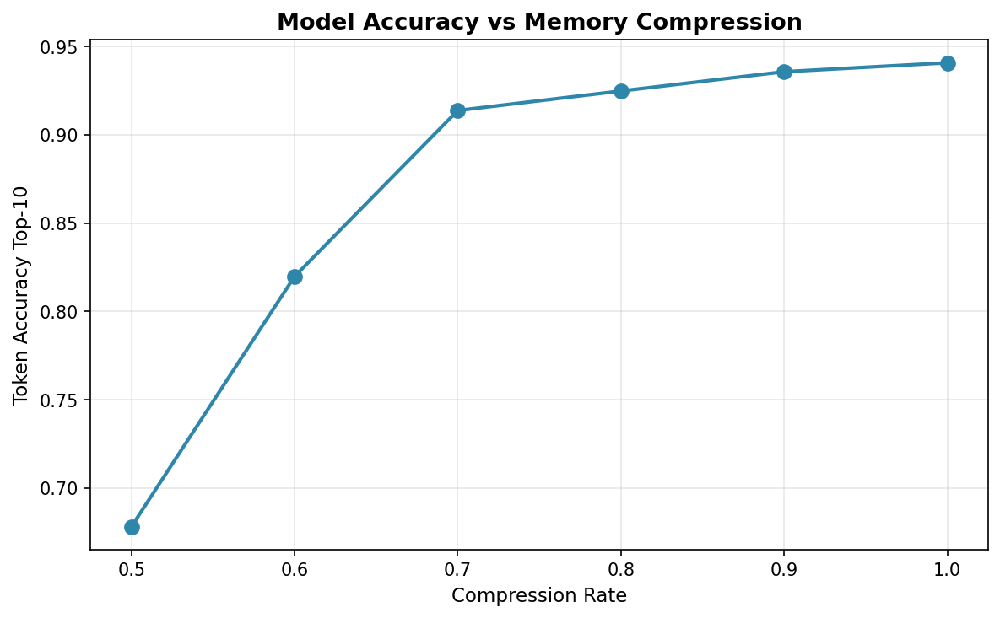

# Puzzletron Algorithm Tutorial

This tutorial demonstrates how to compress large language models using the puzzletron algorithm based on the [Puzzle paper](https://arxiv.org/abs/2411.19146).
The goal of the algorithm it to find the most optimal modifications to MLP and attention layers of the model, resulting in a heterogeneous model architecture.
The supported modifications are:

- `ffn_intermediate_size`: different FFN intermediate sizes
- `attention op/noop`: complete removal of attention layers

To use the Puzzle algorithm effectively, we need to specify the target number of parameters and/or the memory. The final stage is based on Mixed-Integer Programming (MIP) algorithm to find the most optimal combination of layer modifications that satisfy the target requirements.

In this example, we compress the [Llama-3.1-8B-Instruct](https://huggingface.co/meta-llama/Llama-3.1-8B-Instruct) model reducing GPU memory usage from 113 GiB to 96 GiB (15% reduction) with less than 1% regression in the token_accuracy_top_10 metric. Other supported models should be compressed in a similar way. For GptOss there is one [additional step to be performed](GPTOSS.md).

> **Note:** Other models are also supported. See the [configs](./configs/) directory for additional model configurations (e.g., Llama-3.2-3B-Instruct on 1x H100, Qwen2.5-7B-Instruct on 1x H100, Qwen3-8B on 1x H100, Nemotron-Nano-12B-v2 on 1x H100, Mistral-Small-24B-Instruct-2501 on 4x H100). For information on adding support for new models, see the [AnyModel Guide](../../modelopt/torch/puzzletron/anymodel/README.md).

## Environment

### Container setup (NeMo)

The recommended way to run puzzletron is inside an NVIDIA NeMo container (e.g. `nvcr.io/nvidia/nemo:26.02`). NeMo containers ship a pre-installed `nvidia-modelopt` that does not include the puzzletron extras so you need to replace it with an editable install from this repo.

> [!WARNING]
> Use `python -m pip` instead of `pip` to avoid conflicts with the system-wide installed packages in the NeMo containers.

> [!NOTE]
> NeMo containers ship `nvidia-lm-eval` which may conflict with `lm-eval` that is used for evaluation, hence we uninstall and replace it with `lm-eval` from the repo.

Once inside the container with the repo available, install dependencies from the repo root:

```bash
python -m pip uninstall nvidia-lm-eval -y 2>/dev/null
python -m pip install -e ".[hf,puzzletron,dev-test]"
python -m pip install -r examples/puzzletron/requirements.txt
```

To verify the install, you can run the GPU tests as a smoke check:

```bash
python -m pytest tests/gpu/torch/puzzletron/test_puzzletron.py -k "Qwen3-8B"
```

### Hardware

- For this example we are using 2x NVIDIA H100 80GB HBM3 to show multi-GPU steps. You can use also use a single GPU.

- To make use of [Llama-3.1-8B-Instruct](https://huggingface.co/meta-llama/Llama-3.1-8B-Instruct) and [Nemotron-Post-Training-Dataset-v2](https://huggingface.co/datasets/nvidia/Nemotron-Post-Training-Dataset-v2), you need to accept the terms and conditions for the corresponding model and the dataset in the Huggingface Hub. Log in to the Huggingface Hub and enter your HF token.

```bash
hf auth login --token <your token>
```

## Compress the Model

1. Download and prepare the [Nemotron-Post-Training-Dataset-v2](https://huggingface.co/datasets/nvidia/Nemotron-Post-Training-Dataset-v2).

   dataset split: "code", "math", "stem", "chat", excluding reasoning samples (2.62GB)

   ```bash
   python -m modelopt.torch.puzzletron.dataset.prepare_dataset \
      --dataset_name nvidia/Nemotron-Post-Training-Dataset-v2 \
      --output_dir path/to/Nemotron-Post-Training-Dataset-v2
   ```

2. Specify the `puzzle_dir`, `input_hf_model_path`, `dataset_path`, `intermediate_size_list`, and `target_memory` arguments in the [llama-3_1-8B_pruneffn_memory.yaml](./configs/llama-3_1-8B_pruneffn_memory/llama-3_1-8B_pruneffn_memory.yaml) configuration file.

   - `puzzle_dir` indicates a new directory for saving the resulting model.
   - `input_hf_model_path` indicates the local directory with the input model checkpoint.
   - `dataset_path` indicates the directory with the dataset downloaded earlier.

   **_NOTE:_**
   How to choose `intermediate_size_list`?
   The list specifies the candidate FFN sizes that we wish to search over. It is recommended to choose several pruning sizes (e.g. 15%, 20%, 30% etc of the original). Note that the values must be hardware-friendly (divisible by a 256) to avoid issues with tensor operations in subsequent steps.

   Let's first shoot for 32% GPU memory reduction setting `target_memory = 78_000` MiB. This means that the algorithm will choose the candidates with highest accuracy that also meet the specified requirements.

   We can also set the target size of the resulting model using `num_params = 7_000_000_000`. This will be used as an upper bound for the number of parameters of the model.

3. Run the puzzletron pipeline.

   ```bash
   torchrun --nproc_per_node 2 examples/puzzletron/main.py --config examples/puzzletron/configs/llama-3_1-8B_pruneffn_memory/llama-3_1-8B_pruneffn_memory.yaml 2>&1 | tee ./log.txt | grep "Puzzletron Progress"
   ```

   This will save the full output to `log.txt` and display the following progress on screen:

   ```bash
   [2025-11-02 12:06:34][rank-0][main.py:71] Puzzletron Progress 1/8: starting puzzletron pipeline
   [2025-11-02 12:06:45][rank-0][puzzletron_nas_plugin.py:123] Puzzletron Progress 2/8: converting model from HF to DeciLM (single-gpu)
   [2025-11-02 12:07:07][rank-0][puzzletron_nas_plugin.py:132] Puzzletron Progress 3/8: scoring pruning activations (multi-gpu)
   [2025-11-02 12:11:36][rank-0][puzzletron_nas_plugin.py:137] Puzzletron Progress 4/8: pruning the model and saving pruned checkpoints (single-gpu)
   [2025-11-02 12:12:20][rank-0][puzzletron_nas_plugin.py:217] Puzzletron Progress 5/8: building replacement library and subblock statistics (single-gpu)
   [2025-11-02 12:12:21][rank-0][puzzletron_nas_plugin.py:222] Puzzletron Progress 6/8: calculating one block scores (multi-gpu)
   [2025-11-02 12:50:41][rank-0][puzzletron_nas_plugin.py:226] Puzzletron Progress 7/8: running MIP and realizing models (multi-gpu)
   [2025-11-02 12:52:34][rank-0][main.py:115] Puzzletron Progress 8/8: puzzletron pipeline completed (multi-gpu)
   ```

   Once the process is complete, the resulting network architecture will be recorded in `log.txt` for your review:

   ```bash
   ...
   block_0:   attention  gqa_4   ffn  intermediate_14336
   block_1:   attention  gqa_4   ffn  intermediate_14336
   block_2:   attention  gqa_4   ffn  intermediate_14336
   block_3:   attention  gqa_4   ffn  intermediate_14336
   block_4:   attention  gqa_4   ffn  intermediate_14336
   block_5:   attention  gqa_4   ffn  intermediate_14336
   block_6:   attention  gqa_4   ffn  intermediate_14336
   block_7:   attention  gqa_4   ffn  intermediate_14336
   block_8:   attention  gqa_4   ffn  intermediate_14336
   block_9:   attention  gqa_4   ffn  intermediate_14336
   block_10:  attention  gqa_4   ffn  intermediate_14336
   block_11:  attention  gqa_4   ffn  intermediate_14336
   block_12:  attention  gqa_4   ffn  intermediate_14336
   block_13:  attention  gqa_4   ffn  intermediate_14336
   block_14:  attention  gqa_4   ffn  intermediate_14336
   block_15:  attention  gqa_4   ffn  intermediate_14336
   block_16:  attention  gqa_4   ffn  intermediate_14336
   block_17:  attention  no_op   ffn  intermediate_14336
   block_18:  attention  no_op   ffn  intermediate_14336
   block_19:  attention  no_op   ffn  intermediate_14336
   block_20:  attention  no_op   ffn  intermediate_14336
   block_21:  attention  no_op   ffn  intermediate_14336
   block_22:  attention  no_op   ffn  intermediate_14336
   block_23:  attention  no_op   ffn  intermediate_14336
   block_24:  attention  no_op   ffn  intermediate_14336
   block_25:  attention  no_op   ffn  intermediate_14336
   block_26:  attention  no_op   ffn  intermediate_14336
   block_27:  attention  no_op   ffn  intermediate_14336
   block_28:  attention  no_op   ffn  intermediate_14336
   block_29:  attention  gqa_4   ffn  intermediate_14336
   block_30:  attention  gqa_4   ffn  intermediate_14336
   block_31:  attention  gqa_4   ffn  intermediate_14336

   [2025-11-02 04:53:11,332]^[[92m[rank-0]^[[0m[run_puzzle.py:295] Total costs: {'stats.memory_mib': 75796.4140625, 'stats.ffn_num_params': 5637275648, 'stats.num_kv_heads': 160, 'stats.kv_cache_memory_mib': 61440.0, 'stats.ffn_memory_mib': 10752.25, 'stats.attention_memory_mib': 63040.15625, 'stats.attention_num_params': 838942720, 'stats.num_params': 7526895616, 'stats.has_attention': 20, 'stats.has_ffn': 32}
   ...
   ################################################################
   validate_model_and_extract_token_probs(model_name='teacher')
   ################################################################
   ...
   Average losses = {'lm_loss': 1.118250765837729, 'token_accuracy_top_1': 0.7331905364990234, 'token_accuracy_top_5': 0.9094219207763672, 'token_accuracy_top_10': 0.9423646926879883}
   ...
   ################################################################
   validate_model_with_kl_div(model_name='solution_0', is_calc_kl_div=True)
   ################################################################
   ....
   Average losses = {'lm_loss': 1.7577573340386152, 'token_accuracy_top_1': 0.6225490570068359, 'token_accuracy_top_5': 0.846257209777832, 'token_accuracy_top_10': 0.8987817764282227}
   ```

   30% GPU memory reduction leads to nearly 5% regression in token_accuracy_top_10 metric (0.898 / 0.942).

## Re-run MIP Search with different constraints

If you want to try different constraints without re-running the expensive pruning and scoring steps, use the `--mip-only` flag.
This assumes pruning, replacement library building, NAS scoring, and subblock stats calculation have already been completed.

For example, let's set `target_memory: 96_000` in `llama-3_1-8B_pruneffn_memory.yaml`.

```bash
torchrun --nproc_per_node 2 examples/puzzletron/main.py \
   --config examples/puzzletron/configs/llama-3_1-8B_pruneffn_memory/llama-3_1-8B_pruneffn_memory.yaml \
   --mip-only 2>&1 | tee ./log.txt | grep "Puzzletron Progress"
```

This will generate the following network architecture (see `log.txt`):

```bash
block_0:   attention  gqa_4   ffn  intermediate_14336
block_1:   attention  gqa_4   ffn  intermediate_14336
block_2:   attention  gqa_4   ffn  intermediate_14336
block_3:   attention  gqa_4   ffn  intermediate_14336
block_4:   attention  gqa_4   ffn  intermediate_14336
block_5:   attention  gqa_4   ffn  intermediate_14336
block_6:   attention  gqa_4   ffn  intermediate_14336
block_7:   attention  gqa_4   ffn  intermediate_14336
block_8:   attention  gqa_4   ffn  intermediate_14336
block_9:   attention  gqa_4   ffn  intermediate_14336
block_10:  attention  gqa_4   ffn  intermediate_14336
block_11:  attention  gqa_4   ffn  intermediate_14336
block_12:  attention  gqa_4   ffn  intermediate_14336
block_13:  attention  gqa_4   ffn  intermediate_14336
block_14:  attention  gqa_4   ffn  intermediate_14336
block_15:  attention  gqa_4   ffn  intermediate_14336
block_16:  attention  gqa_4   ffn  intermediate_14336
block_17:  attention  gqa_4   ffn  intermediate_14336
block_18:  attention  no_op   ffn  intermediate_14336
block_19:  attention  no_op   ffn  intermediate_14336
block_20:  attention  no_op   ffn  intermediate_14336
block_21:  attention  gqa_4   ffn  intermediate_14336
block_22:  attention  no_op   ffn  intermediate_14336
block_23:  attention  no_op   ffn  intermediate_14336
block_24:  attention  no_op   ffn  intermediate_14336
block_25:  attention  gqa_4   ffn  intermediate_14336
block_26:  attention  gqa_4   ffn  intermediate_14336
block_27:  attention  gqa_4   ffn  intermediate_14336
block_28:  attention  gqa_4   ffn  intermediate_14336
block_29:  attention  gqa_4   ffn  intermediate_14336
block_30:  attention  gqa_4   ffn  intermediate_14336
block_31:  attention  gqa_4   ffn  intermediate_14336

[2025-11-02 12:50:42,024]^[[92m[rank-0]^[[0m[run_puzzle.py:295] Total costs: {'stats.memory_mib': 94708.4609375, 'stats.has_ffn': 32, 'stats.ffn_memory_mib': 10752.25, 'stats.kv_cache_memory_mib': 79872.0, 'stats.attention_num_params': 1090625536, 'stats.ffn_num_params': 5637275648, 'stats.has_attention': 26, 'stats.num_params': 7778578432, 'stats.attention_memory_mib': 81952.203125, 'stats.num_kv_heads': 208}
...
################################################################
validate_model_with_kl_div(model_name='solution_0', is_calc_kl_div=True)
################################################################
Average losses = {'lm_loss': 1.2425934937782586, 'token_accuracy_top_1': 0.703862190246582, 'token_accuracy_top_5': 0.8954982757568359, 'token_accuracy_top_10': 0.9336576461791992
```

On the other hand, if you set `target_memory: 28_000`, you'll observe that the intermediate FFN sizes are significantly reduced in certain layers (see `log.txt` for details):

```bash
block_5:   attention  no_op   ffn  intermediate_11520
block_6:   attention  no_op   ffn  intermediate_14336
block_7:   attention  no_op   ffn  intermediate_8704
block_8:   attention  no_op   ffn  intermediate_14336
block_9:   attention  no_op   ffn  intermediate_3072
block_10:  attention  no_op   ffn  intermediate_11520
block_11:  attention  no_op   ffn  intermediate_11520
block_12:  attention  no_op   ffn  intermediate_11520
block_13:  attention  no_op   ffn  intermediate_11520
block_14:  attention  no_op   ffn  intermediate_3072
```

### MIP Sweep Mode

The **MIP sweep mode** lets you explore multiple memory compression rates in a single run and compare the accuracy-memory trade-offs.

#### Quick Start

1. Enable sweep in your config YAML (e.g., `llama-3_1-8B_pruneffn_memory.yaml`):

   ```yaml
   mip:
     sweep:
       enabled: true
       memory_compression_rates: [0.5, 0.6, 0.7, 0.8, 0.9, 1.0]
       output_csv: ${puzzle_dir}/mip_sweep_results.csv
   ```

2. Run the sweep:

   ```bash
   torchrun --nproc_per_node 2 examples/puzzletron/main.py \
      --config examples/puzzletron/configs/llama-3_1-8B_pruneffn_memory/llama-3_1-8B_pruneffn_memory.yaml \
      --mip-only 2>&1 | tee ./log.txt | grep "Puzzletron Progress"
   ```

3. View results: The CSV file contains compression rates, memory usage, and accuracy metrics for each configuration.

#### Example Results



The plot shows how token accuracy changes with different compression rates. Higher compression (0.5 = 50% of original memory) reduces accuracy, while lower compression maintains accuracy closer to the teacher model.

## Evaluation

Evaluate AnyModel checkpoints using [lm-eval](https://github.com/EleutherAI/lm-evaluation-harness) directly.

```bash
python examples/llm_eval/lm_eval_hf.py \
   --model hf \
   --model_args pretrained=path/to/checkpoint,dtype=bfloat16,parallelize=True \
   --tasks mmlu \
   --num_fewshot 5 \
   --batch_size 4
```

For a quick smoke test, add `--limit 10`.

> **Alternative:** For server-based evaluation via an OpenAI-compatible endpoint,
> see [evaluation/nemo_evaluator_instructions.md](./evaluation/nemo_evaluator_instructions.md).

## Deploy compressed model in vLLM

To deploy a compressed model in vLLM, install vLLM fork with AnyModel enabled:

```bash
git clone https://github.com/askliar/vllm.git
cd vllm
git checkout feature/add_anymodel_to_vllm
VLLM_USE_PRECOMPILED=1 uv pip install --editable . --torch-backend=auto
```

See [vLLM documentation](https://docs.vllm.ai/en/latest/getting_started/installation/gpu/index.html#build-wheel-from-source) for more details on installation.

**NOTE:** This is a temporary workaround pending official vLLM integration. You can track merge status [here](https://github.com/vllm-project/vllm/pull/36512).

Then, add the following to the model's `config.json` file (here we use Llama as an example):

```json
{
  ...
  "architectures": ["AnyModel"],
  "base_architecture": "LlamaForCausalLM",
  ...
}
```

For new architectures that are not supported by vLLM, you additionally need to add the following to the `config.json` file (using Llama3 as an example):

```json
{
  ...
  "anymodel_arch_info": {
    "decoder_layer_module": ".<module_name>",
    "decoder_layer_class": "<decoder_layer_class_name>",
    "base_model_module": ".<base_model_module_name>",
    "layers_path": "<layers_path>",
    "init_prefix": "model",
    "Layer_hf_config": "<Layer_hf_config>"
  }
  ...
}
```

With these changes it is now possible to load the compressed model in vLLM for inference:

```bash
vllm serve <model_name_or_path>
```

### Inference Performance Benchmarking

Now let's evaluate how much speedup we get with the compressed model in terms of throughput and latency.

- Benchmark latency

```bash
vllm bench latency --model path/to/model --load-format safetensors
```

- Benchmark throughput

```bash
vllm bench throughput --model path/to/model --input-len 2000 --output-len 100 --load-format safetensors
```

## Knowledge Distillation

To recover degradation in the quality of the compressed model, we can use knowledge distillation. This allows transferring the capabilities of the original model to the pruned one.

See [Megatron-Bridge distillation](../megatron_bridge/README.md#distillation) for instructions on using Megatron-Bridge for knowledge distillation. The distillation script supports both standard HuggingFace and Puzzletron AnyModel checkpoints.

For distillation results on Puzzletron-compressed models, see [examples/pruning/puzzletron/](../pruning/puzzletron/README.md).

## Advanced Usage

Modify `llama-3_1-8B_pruneffn_memory.yaml` file for advanced compression scenarios.
