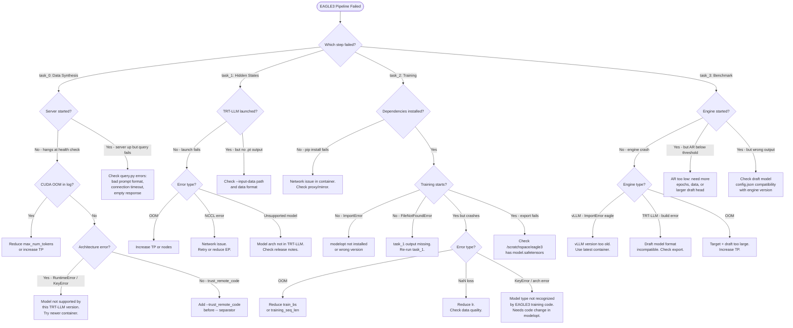

# EAGLE3 Automation Triage Chart

This document catalogs failure modes observed when running the EAGLE3 pipeline across
different model architectures. Updated as new models are tested.

## Model Test Matrix

| # | Model | Type | Params | Status | task_0 | task_1 | task_2 | task_3 | Notes |
|---|-------|------|--------|--------|--------|--------|--------|--------|-------|
| 1 | Qwen3-8B | Dense | 8B | Existing | - | - | - | - | Reference model |
| 2 | Kimi-K2.5 | MoE | 1T/32B | Existing | - | - | - | - | GB200 required |
| 3 | Qwen3.5-9B | Dense (VLM) | 9B | Not run | - | - | - | - | Text-only path |
| 4 | Qwen3.5-27B | Dense (VLM) | 27B | Not run | - | - | - | - | Text-only path |
| 5 | Qwen3.5-35B-A3B | MoE (VLM) | 35B/3B | **Blocked** | TIMEOUT | FAIL | FAIL | FAIL | Data synth too slow; infra issues |
| 6 | MiniMax-M2.5 | MoE | 230B/10B | **Blocked** | TIMEOUT | FAIL | FAIL | FAIL | trust_remote_code needed |
| 7 | Ministral-3-8B | Dense (VLM) | 8B | **WIP** | SKIP | PASS | PASS | FAIL | `use_cache=null` in export; see below |
| 8 | Ministral-3-14B | Dense (VLM) | 14B | **Blocked** | FAIL | FAIL | FAIL | FAIL | vLLM engine init fails (NoneType) |
| 9 | DeepSeek-V3.2 | MoE (MLA) | 685B/37B | **Blocked** | no log | FAIL | FAIL | FAIL | No task_0 log; infra issues |
| 10 | gpt-oss-20b | Dense | 20B | **Blocked** | FAIL | FAIL | FAIL | FAIL | Tokenizer `HarmonyError` |
| 11 | Step-3.5-Flash | MoE (SWA) | 197B/11B | **Blocked** | TIMEOUT | FAIL | FAIL | FAIL | Data synth hit time limit |
| 12 | GLM-5 | MoE (DSA) | 744B/40B | Not run | - | - | - | - | 2 nodes, gated |

Legend: PASS / FAIL-{code} / SKIP / Pending

## Triage Decision Tree



## Observed Failure Catalog

This section is updated as models are tested. Each entry records the model, step,
error, root cause, and resolution.

### Architecture-Level Failures

| Category | Affected Models | Step | Error | Root Cause | Resolution |
|----------|----------------|------|-------|------------|------------|
| VLM text-only | Qwen3.5-*, Ministral-3-* | task_0 | TBD | VLM models may load vision encoder unnecessarily | TBD — may need --language-model-only |
| VLM detection miss | Ministral-3-* | task_2 | `ValueError: Unrecognized config for AutoModelForCausalLM` | `load_vlm_or_llm` only checks `"vl"` in model_type; `"mistral3"` missed | Check `text_config`/`llm_config` attrs — fixed in repo |
| Missing HF shard | Ministral-3-8B | task_2 | `FileNotFoundError: model-00001-of-00004.safetensors` | Incomplete HF shards + Mistral native `consolidated.safetensors` | Fallback to consolidated with key aliases — fixed in repo |
| Exported config validation | All (via FakeBaseModel) | task_3 | `StrictDataclassFieldValidationError: use_cache` | Template placeholder `None` not filled; strict `huggingface_hub` rejects | Set `use_cache: True` in template — fixed in repo |
| MLA attention | DeepSeek-V3.2 | task_2 | TBD | EAGLE3 decoder type may not support MLA | TBD — verify eagle_decoder_type |
| Custom model code | MiniMax-M2.5 | task_0 | TBD | Non-standard architecture needs trust_remote_code | Add --trust_remote_code |
| Sliding window attn | Step-3.5-Flash | task_1 | TBD | SWA may not be supported in TRT-LLM hidden state extraction | TBD |
| Large MoE (>1 node) | DeepSeek-V3.2, GLM-5 | task_0/1 | TBD | Multi-node EP coordination | TBD — verify NCCL config |
| Gated models | DeepSeek-V3.2, GLM-5 | task_0 | FileNotFoundError | Model not mirrored to /hf-local | Request HF local mirror |

### Per-Model Test Results

#### Model: Ministral-3-8B-Instruct-2512-BF16

- **Date tested:** 2026-05-26
- **Config:** `tools/launcher/examples/Mistral/Ministral-3-8B/eagle3_quick_check.yaml`
- **Experiments:** `cicd_1779312692` (dump), `cicd_1779829129` (train+bench), `cicd_1779901409` (retry w/ fixes)
- **task_0 (data synth):** SKIP — used vLLM dump path instead (`dump_offline_data_vllm.sh`)
- **task_1 (hidden states):** PASS — 330/330 conversations via vLLM dump (`cicd_1779312692`)
- **task_2 (training + export):** PASS — required 2 runtime patches (see issues below). `train_loss=31.93`, epoch 1, 278s total. Export to `/scratchspace/export` succeeded.
- **task_3 (benchmark):** FAIL — `StrictDataclassFieldValidationError: use_cache expected bool, got None`
- **AR:** Not measured (benchmark didn't complete)
- **New failure patterns?** Yes — 3 issues:

  1. **VLM detection miss** — `model_type="mistral3"` is a VLM (`Mistral3ForConditionalGeneration`) but `load_vlm_or_llm` only checks `"vl" in model_type`. Fix: also check `text_config`/`llm_config` attrs. Applied in `modelopt/torch/speculative/utils.py` + runtime patch.

  2. **Missing HF shard** — Checkpoint has shards 2-4 + `consolidated.safetensors` but shard 1 is absent. `FakeBaseModel._load_weights` fails. Fix: fallback to `consolidated.safetensors` with Mistral native key aliases (`tok_embeddings.weight`, `output.weight`). Applied in `modelopt/torch/speculative/plugins/modeling_fakebase.py` + runtime patch.

  3. **`use_cache=null` in exported config** — Export template placeholder stays `None` when `FakeBaseConfig` doesn't define `use_cache`. Newer `huggingface_hub` strict validation rejects it. Fix: set `"use_cache": True` in export template (draft models always use cache). Applied in `modelopt/torch/export/plugins/hf_spec_configs.py` + post-export fixup in pipeline.

  4. **(Potential) vLLM Pixtral resolution** — vLLM resolves base model as `PixtralForConditionalGeneration` (VLM). May cause further issues loading the EAGLE3 draft. Needs investigation.

- **Repo fixes (branch `yeyu/speculative-lora-cotrain`):**
  - `modelopt/torch/speculative/utils.py` — VLM detection via `text_config`/`llm_config`
  - `modelopt/torch/speculative/plugins/modeling_fakebase.py` — consolidated.safetensors fallback
  - `modelopt/torch/export/plugins/hf_spec_configs.py` — `use_cache: True` in templates
- **Pipeline fixes (`common/eagle3/train_eagle.sh`):** runtime patches matching above (applied only if the container ships an older modelopt)

---

#### Model: gpt-oss-20b

- **Date tested:** 2026-04-15
- **Config:** `tools/launcher/examples/OpenAI/GPT-OSS-20B/eagle3_quick_check.yaml`
- **Experiment:** `cicd_1776272530`
- **task_0 (data synth):** FAIL — `openai_harmony.HarmonyError: error downloading or loading vocab file`. vLLM server starts loading model but tokenizer fails. Likely a gated/proprietary tokenizer issue.
- **task_1 (hidden states):** FAIL — `dump_offline_data_vllm.sh: No such file or directory` (script didn't exist at time of run)
- **task_2 (training):** FAIL — `service_utils.sh: No such file or directory` (infra issue at time of run)
- **task_3 (benchmark):** FAIL — `Error retrieving file list: Repo id must be in the form 'repo_name'` — no exported model
- **Blocker:** Tokenizer loading. Needs special tokenizer setup or newer vLLM with OpenAI model support.

#### Model: Qwen3.5-35B-A3B

- **Date tested:** 2026-04-15
- **Config:** `tools/launcher/examples/Qwen/Qwen3.5-35B-A3B/eagle3_quick_check.yaml`
- **Experiment:** `cicd_1776272531`
- **task_0 (data synth):** TIMEOUT — Server started successfully, data synthesis was running (5%/3295 at 38min), cancelled at time limit. `TCPTransport closed` errors during generation.
- **task_1:** FAIL — script not found (infra issue)
- **task_2:** FAIL — infra issue
- **task_3:** FAIL — no exported model
- **Blocker:** Data synthesis too slow. Needs longer wall time or reduced dataset size. Server itself works.

#### Model: Step-3.5-Flash

- **Date tested:** 2026-04-15
- **Config:** `tools/launcher/examples/StepFun/Step-3.5-Flash/eagle3_quick_check.yaml`
- **Experiment:** `cicd_1776272532`
- **task_0 (data synth):** TIMEOUT — `CANCELLED AT 2026-04-15 DUE TO TIME LIMIT`
- **task_1:** FAIL — script not found (infra issue)
- **task_2:** FAIL — infra issue
- **task_3:** FAIL — no exported model
- **Blocker:** Data synthesis hit time limit. Needs investigation of whether server started successfully.

#### Model: MiniMax-M2.5

- **Date tested:** 2026-04-15
- **Config:** `tools/launcher/examples/MiniMax/MiniMax-M2.5/eagle3_quick_check.yaml`
- **Experiment:** `cicd_1776272524`
- **task_0 (data synth):** TIMEOUT — `CANCELLED DUE TO TIME LIMIT`
- **task_1:** FAIL — script not found (infra issue)
- **task_2:** FAIL — infra issue
- **task_3:** FAIL — `trust_remote_code=True` required for custom model code
- **Blocker:** Time limit on data synth + `trust_remote_code` needed for benchmark.

#### Model: Ministral-3-14B

- **Date tested:** 2026-04-15
- **Config:** `tools/launcher/examples/Mistral/Ministral-3-14B/eagle3_quick_check.yaml`
- **Experiment:** `cicd_1776272522`
- **task_0 (data synth):** FAIL — `TypeError: 'NoneType' object is not iterable` on all TP workers during engine core init. vLLM cannot load this model architecture.
- **task_1:** FAIL — script not found (infra issue)
- **task_2:** FAIL — infra issue
- **task_3:** FAIL — `KeyError: 'ministral3'` — transformers in vLLM container doesn't recognize `ministral3` model type
- **Blocker:** vLLM engine fails to initialize. Same `mistral3` model type issue as 8B variant. Needs newer vLLM + transformers.

#### Model: DeepSeek-V3.2

- **Date tested:** 2026-04-15
- **Config:** `tools/launcher/examples/DeepSeek/DeepSeek-V3.2/eagle3_quick_check.yaml`
- **Experiment:** `cicd_1776275945`
- **task_0 (data synth):** No log file — job may not have started (gated model?)
- **task_1 (hidden states):** FAIL — script not found (infra issue)
- **task_2:** FAIL — infra issue
- **task_3:** FAIL — `Error retrieving file list` — no exported model
- **Blocker:** Model may not be mirrored to `/hf-local`. Needs 2 nodes for MLA architecture.

---

*Use the following template for additional models:*

```markdown
#### Model: <name>
- **Date tested:** YYYY-MM-DD
- **Config:** tools/launcher/examples/<Org>/<Model>/eagle3_quick_check.yaml
- **task_0:** PASS/FAIL — <notes>
- **task_1:** PASS/FAIL — <notes>
- **task_2:** PASS/FAIL — <notes>
- **task_3:** PASS/FAIL — <notes>
- **AR:** <value> (threshold: >= 2.1)
- **New failure pattern?** Yes/No — <description if yes>
```

## Revision History

| Date | Author | Change |
|------|--------|--------|
| 2026-04-02 | Ye Yu | Initial chart with 12 models, triage decision tree |
| 2026-05-27 | Claude Code | Updated with results from initial batch (`cicd_1776272*`) and Ministral-3-8B deep dive. Added per-model test results for 7 models. Added 4 new failure catalog entries. |
